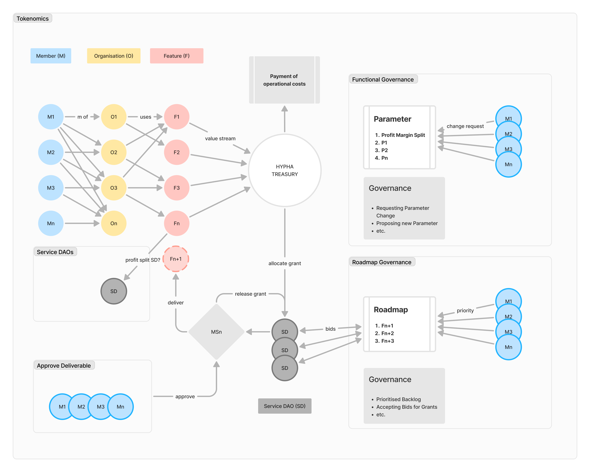

import { TokenDistribution } from '@hypha-platform/epics';
import { Bleed } from 'nextra/components';

# Hypha Tokenomics Paper

## Overview

- Introduction to Hypha's token ecosystem
- Token utility and purpose
- Key token characteristics

## System Architecture

<Bleed></Bleed>

### Core Actors

- **Members (M)**: Individual participants in the ecosystem
- **Organizations (O)**: Organizational entities that can use platform features
- **Features (F)**: Platform functionalities and services

### Governance Structure

1. **Functional Governance**

   - Parameter management system
   - Profit margin split configurations
   - Change request mechanisms
   - Parameter proposal system

2. **Roadmap Governance**
   - Feature prioritization
   - Backlog management
   - Grant bidding system
   - Milestone delivery tracking

### Operational Components

- **HYPHA Treasury**: Central value management system
- **Service DAOs**: Specialized service delivery organizations
- **Milestone System**: Deliverable tracking and approval mechanism
- **Value Streams**: Revenue flow from features to treasury
- **Grant Allocation**: System for distributing resources to service providers

## Token Distribution

- Initial token allocation
- Distribution schedule
- Vesting periods
- Token supply metrics
  - Total supply
  - Circulating supply
  - Maximum supply

## Token Utility

- Governance rights
  - Parameter change voting
  - Feature prioritization
  - Deliverable approval
- Platform access
- Staking mechanisms
- Rewards and incentives
- Fee structure

## Token Economics

- Value accrual mechanisms
  - Operational cost management
  - Treasury allocation system
  - Service DAO profit splits
- Deflationary/inflationary mechanisms
- Token burning mechanisms
- Market dynamics

## Governance

- Voting mechanisms
  - Member voting rights
  - Organization-level decisions
  - Feature approval process
- Proposal creation
- Decision-making process
- Staking requirements for governance

## Incentive Structure

- User rewards
- Community incentives
- Participation rewards
- Staking rewards

## Token Security

- Smart contract security
- Audit information
- Risk mitigation strategies

## Future Development

- Roadmap for token utility expansion
- Planned economic adjustments
- Long-term sustainability plans

## Technical Implementation

- Smart contract architecture
- Token standard
- Integration points
- Security measures

## Additional Resources

- Token contract address
- Official documentation
- Community channels
- Relevant links
