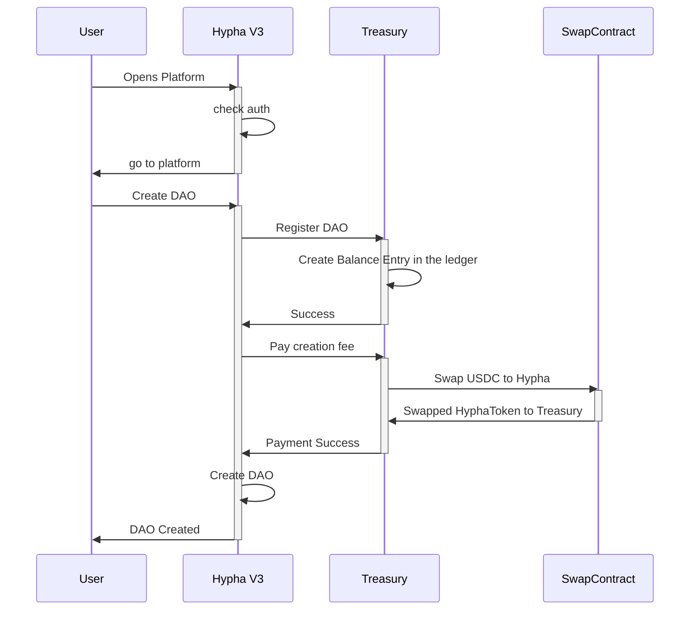

# MVP: Single Token Create DAO Flow

## Overview

This document describes the flow for creating a DAO using our single token system. The process involves creating an initial balance via our Treasury Smart Contract.

## Technical Implementation

One smart contract manages all spaces and tracks their respective balances.

## Token Utility

### Why do we need a Token?

1. Raise funds for platform development and maintenance
2. Enable community governance and decision-making
3. Create aligned incentives between platform and users
4. Facilitate value capture from platform usage
5. Enable future ecosystem expansion and integrations

### Token Economics

- Fixed supply: [Supply amount]
- Initial distribution: [Distribution details]
- Vesting schedules: [Vesting details]
- Treasury allocation: [Allocation details]

## Security Considerations

- Smart contract auditing
- Rate limiting for token swaps
- Treasury multi-sig requirements
- Governance timelock mechanisms
