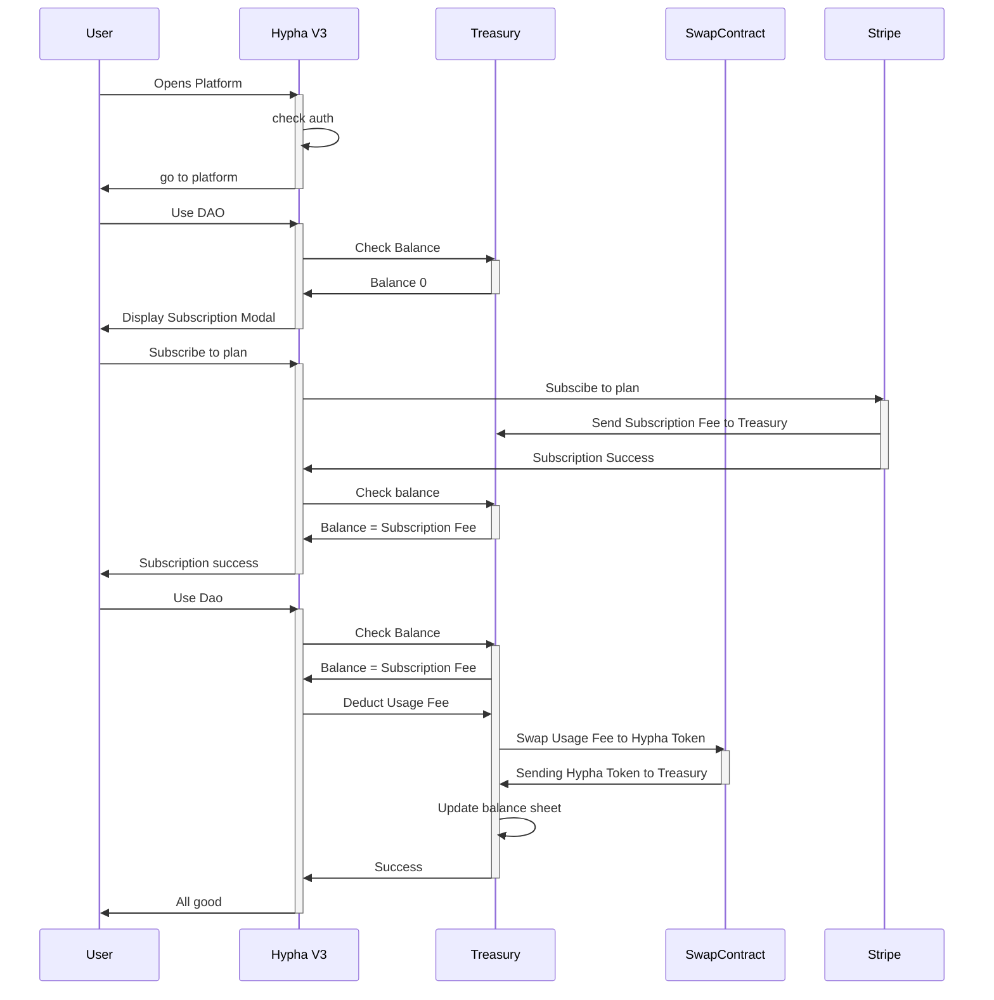

# MVP: Single Token Subscription Flow

## Overview

This document describes the subscription and usage fee system for DAOs in the Hypha platform. The process involves managing subscription payments through Stripe and converting usage fees to HyphaTokens via our SwapContract.

## Process Flow

1. User attempts to use DAO features
2. System verifies treasury balance
3. For new/depleted accounts:
   - System displays subscription modal
   - User selects and purchases subscription plan via Stripe
   - Subscription fees are added to Treasury balance
4. For active subscriptions:
   - System deducts usage fees
   - Fees are converted to HyphaToken
   - Treasury balance is updated

## Technical Implementation

The subscription system uses a combination of Stripe for fiat payments and our SwapContract for token conversion.

## Subscription Features

### Payment Processing

- Stripe integration for fiat payments
- Automatic subscription renewal
- Flexible plan options
- Usage-based billing

### Balance Management

- Real-time balance tracking
- Automatic fee deduction
- Low balance notifications
- Usage history tracking

### Token Conversion

- Automatic conversion of usage fees to HyphaToken
- Transparent fee structure
- Real-time market rate integration
- Efficient treasury management

## Security Measures

- Secure payment processing through Stripe
- Rate limiting on subscription changes
- Balance verification on all transactions
- Audit trail of all fee conversions
- Automated balance reconciliation

## Integration Points

### Stripe Integration

- Subscription plan management
- Payment processing
- Invoice generation
- Payment method management

### Treasury Integration

- Balance tracking
- Fee collection
- Token conversion
- Usage accounting

### User Experience

- Seamless subscription flow
- Clear balance visibility
- Usage monitoring tools
- Subscription management interface
