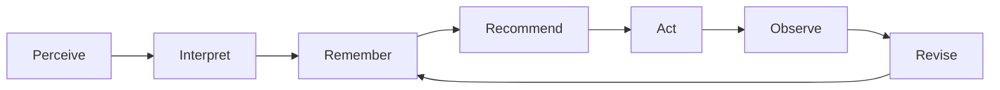

# Organizational Intelligence — Memory Architecture

**Target-state architecture**, written for the whole team. It answers five questions:

1. How is organizational memory maintained?
2. How does the AI retrieve from it?
3. How big can memory get — can we give the AI _absolutely everything_ about the organization?
4. How does the AI work out what is relevant?
5. How do we make the AI actually intelligent?

Companion to [User Journeys](../product/user-journeys.md), which describes what this is for.

Numbers here are grounded in two documents that currently live on other branches: the measured AI
cost model (`docs/hypha-ai-cost/`, branch `docs/hypha-ai-cost-per-space`) and the frozen Space
Intelligence spec (`docs/plans/space-intelligence.md`, branch `feat/org-memory` /
[PR #2461](https://github.com/hypha-dao/hypha-web/pull/2461)).

---

## 0. The core idea

An organization is intelligent to the degree it can reliably run one loop:

Most AI products build only **Recommend**, wired directly to a model, and call it intelligence. It
isn't — it's autocomplete with company data. The intelligence lives in the loop being _closed_: the
organization observes what happened after it acted, and revises what it believes.

This has one strategic consequence worth stating plainly:

> **The model is a commodity. The memory and the loop are the asset.**

Our own cost analysis shows a ~24× price spread between models of broadly comparable quality, and
the frontier moves every few months. Anything we build that depends on a specific model is
temporary. What no competitor can replicate is a curated, versioned, human-approved record of what
_this_ organization believes, plus the history of what it tried and what happened. That is what we
are building. The model is a rented interpreter for it.

---

## 1. Four layers of memory

Almost every failed AI-memory project fails by conflating these. They have different sizes,
different writers, different lifespans, and — critically — different rules about whether they are
ever allowed near the AI's context.

|        | Layer           | What it holds                                                                                     | Rough size                        | Written by                              | Reaches the AI         |
| ------ | --------------- | ------------------------------------------------------------------------------------------------- | --------------------------------- | --------------------------------------- | ---------------------- |
| **L1** | Substrate       | chat messages, call recordings, uploaded files, raw blockchain events                             | millions of tokens, grows forever | machines, automatically                 | **never directly**     |
| **L2** | Activity ledger | typed timestamped facts: _proposal 12 executed_, _treasury −8%_, _member joined_, _signal closed_ | large, grows forever              | the system, automatically               | **only as aggregates** |
| **L3** | Semantic memory | what the organization believes: purpose, stakeholders, risks, charter, standing assessments       | **small — tens of documents**     | humans, and AI proposals humans approve | **always**             |
| **L4** | Decision memory | recommendation → action → outcome chains; what we tried, what happened, what we now think instead | medium                            | the system, on state change             | **selectively**        |

Where we stand today: L1 exists. L3 is built and awaiting merge (the Space Intelligence Markdown
artifacts). L2 exists as an unused table. **L4 does not exist.** L2 and L4 are both ordinary
database tables — inexpensive to build, and they are what make the loop closeable.

The single most important design rule follows from this table:

> **L3 holds interpretation. It never holds readings.**

Treasury balances, vote counts, and membership numbers change constantly and are always fetched
live at question time. If a number gets written into a memory document, the AI will confidently
recite a stale figure forever. Artifacts say _"we are over-exposed to a single funding source"_;
they never say _"we hold 43,000 USDC"_.

A second rule carries equal weight, and it governs where memory draws its authority from:

> **Deliberative artifacts record what the organization believes about itself. Behavioural evidence
> records what it did. Where the two disagree, the disagreement is the finding.**

Nearly all of L3 is deliberative — charters, stated risks, standing assessments, proposal text. That
material is indispensable for interpretation, and it is also the organization's self-image. People
posture in governance forums, and a proposal records intent rather than outcome. An intelligence
built mainly from it becomes a very sophisticated model of how a space would like to be seen.

The corrective is behavioural, and in this domain it is unusually good. Treasury movements,
contributor payments actually made, funds deployed against funds promised, votes cast rather than
opinions voiced — money is the least dishonest signal an organization emits, and in a DAO it is
public and cryptographically verifiable rather than merely observed. That is L2, which is why L2
sitting unused is a foundational gap rather than deferred plumbing.

Two consequences for how the system should behave:

- **Anchor interpretation to evidence.** An L3 claim that no ledger fact supports is an opinion.
  Assertions that go long enough without behavioural corroboration should be surfaced for review,
  not quietly retained as fact.
- **Treat the gap as the product.** The distance between what a space committed to and what its
  ledger shows it did is the most valuable thing this system can show a member — and it is invisible
  to everyone today precisely because nobody holds both halves at once.

---

## 2. How memory is maintained

Memory quality is a governance process, not a storage problem. The lifecycle:

**Capture.** Raw material accumulates in L1 continuously. Nothing is curated at this stage.

**Propose.** Something — the AI, a connected app, or a person — proposes that the organization
should _know_ something. The AI's default is always to propose, never to publish. This is the
critical guardrail: memory an AI can silently rewrite launders hallucination into institutional
truth, which is strictly worse than having no memory at all.

**Approve.** A member reviews the proposed change against the current version and accepts, edits,
or rejects it. This moment is where human judgment enters the corpus, which makes it the most
valuable data we collect — we should record the _edits_ approvers make, not just the yes/no.

**Version.** The approved change is written as a new immutable version, content-addressed, with a
pointer to what it supersedes. Old versions stay readable forever. This is what lets the
organization ask "what did we believe in March, and who changed it, and why?"

**Consolidate.** On a regular rhythm, the AI proposes compressions: these four overlapping insights
are one insight; this assessment is contradicted by that decision. Humans approve. This is the
mechanism that keeps the corpus small, and it should be a scheduled organizational ritual rather
than a background job nobody sees.

**Retire.** Beliefs that no longer hold are marked superseded or contested with a recorded reason.
Nothing is deleted.

Two properties every artifact carries:

- **Provenance** — which app or person produced it, when, and from what.
- **A falsification condition** — what would make this wrong? The energy-pack templates already
  ask "how will we know this identity still fits". Generalize that. A belief with no stated way of
  being wrong can never be revised, and will quietly rot.

### The invariant that matters most

> **L3 must stay small enough that a person could read all of it in an afternoon.**

This is not an efficiency target, it is what makes the memory trustworthy. A corpus nobody can
audit is a corpus nobody should rely on. If a space accumulates two hundred "insights", the
organization has no insight — it has a landfill. Growth in L3 is a symptom to investigate, not
progress to celebrate.

---

## 3. How the AI retrieves — the context budget

We do not "search a big pile." We **spend a fixed budget** on every turn, filled in a defined
order. The ordering is the design.

The key move — and the answer to most of the difficulty — is this:

> **Always send the _map_ of memory. Send the _contents_ only on demand.**

The whole index of an organization's memory (every artifact's title, type, status, last-updated
date, and a one-line summary) costs around **1,500 tokens**. The full text of all those artifacts
costs around **60,000**. So for roughly 2% of the cost, the AI can always know _everything it
knows about_ — and then ask precisely for the two or three documents it actually needs.

This is why we do not need a vector database to get good behaviour. The model is choosing from a
short labelled menu, which is something models are extremely reliable at, rather than guessing
search keywords and hoping.

A typical turn, budgeted:

| Slice                                                          | Tokens       | Always present? |
| -------------------------------------------------------------- | ------------ | --------------- |
| System prompt (trimmed from today's 5.6k)                      | 3,000        | yes             |
| Identity card — who this org is, its purpose, its phase        | 300          | yes             |
| Memory index — one line per artifact                           | 1,500        | yes             |
| Current state — members, treasury, open proposals, top signals | 700          | yes             |
| What changed since this person last looked                     | 1,000        | yes             |
| Selected artifact bodies (2–4, chosen from the index)          | 6,000        | on demand       |
| Conversation history (bounded, not the full transcript)        | 3,000        | trimmed         |
| **Total**                                                      | **≈ 15,500** |                 |

For comparison, a multi-tool advisory task today consumes about **28,000** input tokens. So the
proposed design is both **better grounded and roughly half the cost** of current behaviour — because
the index replaces bulk loading, and history is bounded instead of re-sent whole.

The first four slices are stable between turns, which makes them ideal for prompt caching (cached
reads run 60–80% cheaper on most hosts).

---

## 4. How big can memory be? Can we provide _everything_?

This is the question that most needs a real answer, so here is the arithmetic.

**The curated memory of an entire organization is small.** A realistic artifact is one to two pages
— call it 2,000 tokens. A mature organization with a fully populated ontology has perhaps 30 of
them. That is **~60,000 tokens for everything the organization believes about itself.** Every
current frontier model has a context window several times larger than that. So yes: technically,
we could put the organization's entire belief system into every single request.

**The raw substrate is not small, and never will be.** Working from the measured cost model — around
120 discussion-summary runs and 6 call transcripts per month for a typical space — a single active
organization generates on the order of **one to three million tokens of chat and transcript per
year**, growing every year. That is twenty to fifty times the curated corpus in year one alone, and
the ratio worsens indefinitely.

So the honest formulation of what we can offer:

> **We can give the AI everything the organization _believes_. We can let it query everything the
> organization has _done_. We will never send it everything the organization has _said_.**

L3 goes in whole (or as an index plus selections). L2 is queried and arrives as aggregates and
trends. L1 is reachable only by explicit drill-down into a specific transcript or file.

### Why we should not send everything even when we can

There are two arguments, and the weaker one is about money.

**Cost** — at 15,500 tokens per turn a typical space is affordable on any tier; at 60,000+ per turn,
premium models get expensive fast. But this argument erodes every year as prices fall, so we should
not build the architecture around it.

**Attention** — this is the durable argument. A model's ability to use a fact _degrades_ as that
fact is buried in more undifferentiated context. The same document that produces a sharp answer in
a 4,000-token context produces a vague one inside 60,000 tokens of everything-else. Filling the
window is not the same as informing the model.

Which yields the principle:

> **Curation is an accuracy requirement, not a cost optimization.**

We keep memory small because it makes the AI _better_, and it happens to also make it cheaper. If
inference were free tomorrow, this architecture would not change.

---

## 5. How the AI works out what is relevant

Relevance is decided in a fixed order, cheapest and most reliable signals first. A memorable
shorthand: **pinned, changed, nearby, named, fresh, similar.**

1. **Pinned** — identity, purpose, and charter are always in context. Not a ranking decision.
2. **Changed** — the activity ledger says what actually moved since this person last looked,
   weighted by magnitude and by whether it touches an open decision. This is deterministic, and it
   is where most genuinely useful advice comes from. _Trend beats snapshot._
3. **Nearby** — artifacts linked to whatever the person is currently looking at: this signal, this
   proposal, this member. The artifact-to-signal graph already gives us this.
4. **Named** — the model selects from the always-present index by label. Reliable because the menu
   is short and well described.
5. **Fresh** — prefer current over contested; never load superseded versions unless the question is
   explicitly historical.
6. **Similar** — semantic search by embedding. **Deliberately last, and not needed yet.** It becomes
   worthwhile only when the index itself outgrows the budget (order of a hundred-plus artifacts),
   and even then it should run over artifact _summaries_, not raw text chunks.

Building steps 1–5 first is not a compromise on the way to "real" retrieval. Steps 1–5 are more
accurate, fully explainable, and free. Step 6 is an optimization for scale we do not have.

---

## 6. How we make the AI intelligent

Four ingredients, and the model is not one of them.

**Grounding — it knows this organization.** Everything it says is anchored in the curated corpus and
cites what it drew on. An uncited recommendation is an opinion, and the organization already has
plenty of those.

**Salience — it knows what changed.** Detection comes from thresholds on the activity ledger, not
from a model. This is the difference between advice and a horoscope. It is worth being explicit
about how the work divides:

| Job                                  | Do it with                        | Because                                                             |
| ------------------------------------ | --------------------------------- | ------------------------------------------------------------------- |
| Detect that something changed        | deterministic rules on the ledger | must be reproducible, auditable, and cheap enough to run constantly |
| Decide whether it matters            | rules plus organizational context | needs to be inspectable when it gets it wrong                       |
| Explain what it means and what to do | the language model                | requires judgment and phrasing, which is what models are for        |

Today's system does both jobs with arithmetic, which is why its output reads like a fortune cookie.
The mistake to avoid next is the mirror image — using a model as the trigger, which is
non-deterministic, unauditable, and expensive to run continuously.

**Judgment — it knows how this organization decides.** Decision memory means the AI can say "you
faced this in March, chose that, and here is how it turned out." No general-purpose model has
access to that, and it is the thing that makes advice feel like it came from a colleague rather
than a consultant.

**Feedback — it knows whether it was right.** Every proactive recommendation records whether a human
acted on it. That number is simultaneously our product KPI and the loop's error signal. Below
roughly a third acceptance, the channel is noise and should be switched off rather than tuned —
because a low-quality proactive channel is not a neutral placeholder. It spends the attention
budget you need for the real thing.

And the delivery contract, which is where intelligence becomes visible or fails:

> Every proactive recommendation must name **an owner**, state **one specific next action**, and
> **cite the evidence** it rests on. If it cannot do all three, it is not sent.

---

## 7. Anti-patterns we are choosing against

Each of these is a plausible, popular design that we are consciously rejecting.

- **Vector-database-first memory.** Opaque, unauditable, unmaintainable by the organization itself.
  We use readable Markdown that a member can correct. Embeddings are an optimization we add later,
  if ever.
- **Letting the AI write memory directly.** Turns model error into institutional belief with no
  audit trail. Propose-then-approve, always.
- **A model as the proactive trigger.** Non-deterministic, unexplainable, and costly to run
  continuously. Rules trigger; models explain.
- **Unbounded accumulation.** "Store everything, retrieve later" produces a corpus nobody trusts
  and a retrieval problem that gets harder forever.
- **Numbers inside memory documents.** Guarantees confident stale answers. Volatile state is always
  fetched live.
- **Notification per event.** Destroys the attention budget. Digest, then earn the interrupt.
- **Escalating by default.** Sending anything uncertain to a vote feels safe and is not. It
  manufactures approval fatigue, which then degrades the votes that actually matter. Route to the
  lightest channel that fits — see §8.
- **Measuring activity.** Artifacts created and messages sent are vanity metrics that actively
  reward the wrong behaviour. Measure acceptance and outcomes.

---

## 8. Decision rights — what becomes a proposal

An intelligent organization is not one that decides more things together. It is one that knows
which things need deciding together. If every recommendation can become a proposal, approval
fatigue sets in, participation collapses, and the votes that genuinely matter get rubber-stamped
alongside the ones that don't. **Protecting the vote channel is a core architectural concern**, not
a governance nicety, because the AI will be generating candidate decisions faster than any previous
system did.

### The wrong test

"Anything involving money is a proposal" is the intuitive rule, and it fails in both directions.

It **under-protects**: the most consequential decisions in a Hypha space are not spends, they are
rule changes. Altering the voting method, the entry or exit method, or who counts as a member
reshapes every future decision — which is why the platform already treats those as proposals
(`change-voting-method`, entry/exit methods, space-to-space membership) alongside the monetary ones
(`issue-new-token`, `mint-tokens-to-space-treasury`, `token-burning`).

It also **fails to reduce load**: "does money move?" catches every reimbursement, contractor
invoice, and tool subscription. The overwhelm remains.

### The test

A decision requires a vote only on **yes to both**:

1. **Does it commit shared resources or change shared rules?** Shared means the treasury, the rules
   of the game, who is a member, or anything binding the organization externally. If no, it is
   operational and should never reach a vote.
2. **Is it hard to reverse, or large relative to our capacity?** If no, it belongs to a named owner
   inside a mandate, with a record.

The first question is a claim about rights — people should have a say over decisions whose
consequences land on them and who are not otherwise in the room. The second is what keeps that
principle from consuming the organization.

### The tiers

| Tier | Mechanism                                                              | For                                                         |
| ---- | ---------------------------------------------------------------------- | ----------------------------------------------------------- |
| 0    | Just do it, logged to the ledger                                       | Work inside an existing mandate                             |
| 1    | One named owner approves                                               | Small, reversible, inside a budget envelope                 |
| 2    | **Visible for N days; proceeds unless someone objects, with a reason** | Most of what gets over-escalated to votes today             |
| 3    | Vote                                                                   | Shared resources beyond a mandate; rule changes; membership |
| 4    | Supermajority                                                          | How decisions get made; purpose; exit rights                |

**Tier 2 is the one we do not have, and its absence is the actual cause of the overload.** Most
organizations offer only two channels — do it quietly, or put it to a vote — and since only the
second confers legitimacy, everything ambiguous drifts upward. A visible objection window that
closes in silence gives collective legitimacy without collective effort, and absorbs the majority of
borderline cases.

### Constituencies, not just thresholds

The tiers above vary _how much_ agreement a decision needs. A second axis varies _whose_ agreement it
needs, and it is easy to miss because most governance tooling assumes one electorate.

- Operational decisions need the people accountable for the work.
- Rule changes need the members.
- **Reserved matters** — changing the purpose, diluting holders, disposing of major assets — need
  investor or funder consent, which is a different set of people from the members.
- Decisions that land on the people the organization serves need **beneficiary consultation**, even
  when those people hold no vote at all.

So a decision class is a pair: a threshold _and_ a constituency. A space today can configure
`quorum` and `unity`, which addresses the threshold and nothing else — every vote implicitly has the
same electorate. Supporting the edge stakeholders in
[User Journeys](../product/user-journeys.md#stakeholders) properly means decision classes can name
who must consent, not only how many.

The useful discipline: **being heard and having authority are separate grants, and most edge
stakeholders should get the first without the second.** An investor who can file an observation into
normal triage is well served. An investor who can direct operations has quietly become management.

**Shaper is itself a grant**, named by the founder at creation. A steward or a contributor can hold
it; founding the organization does not keep it forever. It is the body that decides strategy,
funding beyond a mandate, and organizational memory. The product list of every decision and who
takes it lives in
[User Journeys — What has to be decided, and by whom](../product/user-journeys.md#what-has-to-be-decided-and-by-whom).
The same classes, mapped onto this section's tiers:

| Decision class                                                                     | Who decides                                | Tier               |
| ---------------------------------------------------------------------------------- | ------------------------------------------ | ------------------ |
| Constitution at creation (first Shapers, entry/exit, first mandates, trust-ladder) | Founder, AI proposes                       | —                  |
| High-level strategy (purpose, direction, which domains the org needs)              | Shapers                                    | 1 / 3              |
| Add, remove, or replace a steward; create or resize a mandate                      | Shapers                                    | 3                  |
| Change who is a Shaper, voting method, purpose, or entry/exit                      | Shapers                                    | 4                  |
| Green-light a ticket (approve / reject / hold)                                     | Matching steward, before work starts       | 1                  |
| Spend or commit inside an existing envelope                                        | Steward of that mandate                    | 1                  |
| New allocation, spend beyond every envelope                                        | Shapers                                    | 3                  |
| Issue, mint, or burn tokens; space-to-space membership                             | Shapers                                    | 3                  |
| Admit or remove a member                                                           | Whatever entry/exit method the founder set | follows the method |
| Memory update that changes strategy or purpose                                     | Shapers                                    | 1                  |
| Memory update in a domain                                                          | Steward of that domain                     | 1                  |
| Memory hygiene (unsupported assertion, contradiction)                              | Shapers                                    | 0 / 1              |
| Purpose change, dilution, major-asset disposal                                     | Shapers **and** investor consent           | 4 + reserved       |
| Decision that lands on the people the org serves                                   | Shapers decide; beneficiaries consulted    | 3 + heard          |
| Claim, decline, or act on approved work; declare capacity                          | The individual                             | —                  |

### Mandates, not transactions

The highest-leverage move is to change what a vote is _about_.

> **The tier is a property of the decision's relationship to existing mandates, not a property of
> the request.**

Take "we want feature X, we need developer Y, budget Z". Its tier depends entirely on something
outside the request:

- A product domain already holds a quarterly envelope and a named owner → **Tier 0/1**. An owner
  spending their mandate is not a governance event; it is them doing their job.
- It exceeds the envelope, creates an ongoing obligation rather than a one-off, or is the first hire
  in a domain nobody owns → **Tier 3**.
- It needs a domain that does not exist yet → vote on **the mandate**, once. The next thirty
  decisions inside it are then Tier 0/1.

So one vote on "this domain, this owner, this envelope, this review date" retires dozens of future
votes. Mandates are the compression mechanism for governance in the same way that L3 artifacts are
the compression mechanism for memory.

### Where new mandates come from

Mandates should be created from observed need, not asserted need. The mechanism is work routing.

When the system detects that something needs doing, it matches the work to a person using stated
skills and mandates (L3) plus demonstrated history (L2), then checks the match against that person's
**declared** capacity. Most of the time it finds someone. The interesting case is when it does not.

**Unmatched work is a measurement, not a failure.** Left alone, unrouteable work silently lands on
whoever is most responsive, which hides the shortage and burns out the conscientious. Instead it
should stay open, labelled with the capability it needs, and **aggregate**. Three unfilled tasks in
one domain over a month is not three problems; it is one role that does not exist yet.

That aggregate is the evidence base for a Tier 3 proposal to create a mandate — a domain, an owner,
an envelope, a review date. It is the answer to "how do we know we need to hire?" and it means the
proposal arrives with a demonstrated pattern attached rather than someone's conviction.

Three constraints on the matcher itself:

- **Propose, do not allocate.** In a voluntary organization work cannot be assigned, only made
  visible to the person most likely to take it. Suggested owner, reasoning shown, claimable by
  anyone.
- **Reserve a minority of routing for stretch matches.** Matching purely on demonstrated history
  ossifies roles and quietly creates single points of failure. Capabilities held by exactly one
  person are a risk the system is well placed to notice and surface.
- **Capacity is declared, not inferred.** Do not build a load model. Most of what constrains a
  contributor is off-platform and therefore unmeasurable here, and the tempting proxy — open item
  count — penalises whoever takes on slow work. Store a coarse, revisable, self-set limit; use it to
  gate flow rather than to score fit; and let observation surface a discrepancy to the person
  without ever overriding them. "Everyone who fits is at their self-set limit" is then a first-class
  capacity signal, and a much more honest one than an inferred number.

### What this means for the AI

Routing is a more valuable capability than drafting. For every candidate decision the AI should
propose the **lowest** tier satisfying both questions, name the mandate it believes covers it, and
treat escalation as the exception it must argue for. A human can always override the routing
upward; the AI's bias must run downward.

This also yields a governance health metric worth tracking: **what share of votes pass
near-unanimously with no substantive discussion?** Those were not decisions, they were Tier 2 items
taxing everyone's attention. A high consensus rate is a symptom of mis-tiered governance, not of a
healthy organization.

### What the platform would need

Three gaps between this model and what exists today:

- **Per-decision-class thresholds.** `quorum` and `unity` are configurable 0–100, but per _space_,
  not per decision class. Tiering needs a space to say "spending: 20% quorum; rule changes: 80%".
- **An objection-window mechanism.** Tier 2 has no implementation today.
- **A mandate / budget-envelope primitive.** There is nothing for spending to be checked against, so
  no decision can currently be classified as "inside an existing mandate".

---

## 9. Open questions

Worth resolving before or during build, but not blocking the shape above.

1. **Consolidation cadence and trigger** — calendar rhythm, corpus-size threshold, or steward
   discretion?
2. **Per-artifact size limit.** The current cap is 256 KiB, which is roughly 64,000 tokens — a
   single artifact could consume an entire context budget. For documents intended to be
   always-loadable, something closer to 4,000–8,000 tokens seems right. What is the enforcement?
3. **Digest cadence** and whether it is per-person or per-organization.
4. **Where decision outcomes come from** — inferred from on-chain and ledger state, or explicitly
   recorded by a human at close-out? Inference scales; explicit recording is accurate.
5. **Cross-organization memory** — what may be relayed to a parent or sibling space by default, and
   what requires consent?
6. **Model routing.** Our cost analysis suggests a premium tier for interactive work and a cheap
   tier for background jobs lands a typical space at $1–3/month. Which model per tier, and who
   decides?
7. **Objection windows.** How long, who may object, and does one reasoned objection escalate to a
   vote or block outright?
8. **Mandates as a primitive.** Do mandates and budget envelopes become first-class objects, or are
   they expressed as memory artifacts that the AI reads and reasons over? The first is enforceable;
   the second is far cheaper to build.
9. **Who sets the tier when the AI and a member disagree?** A member can escalate upward, but should
   anyone be able to route a decision _downward_ out of the vote channel?

---

## Related

- [User Journeys — The Intelligent Organization](../product/user-journeys.md) — what this serves
- Space Intelligence & Documentation spec — the L3 substrate as specified and built; arrives with
  [PR #2461](https://github.com/hypha-dao/hypha-web/pull/2461) at `docs/plans/space-intelligence.md`
- [Documents and media overview](./documents-and-media-overview.md) — where L1 raw media lives
- [Space Memory panel](../plans/space-memory-panel.md) — current aggregation surface
