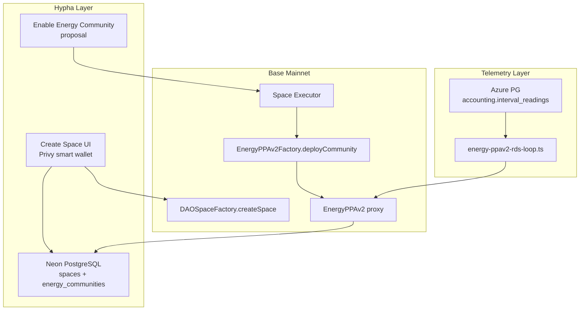
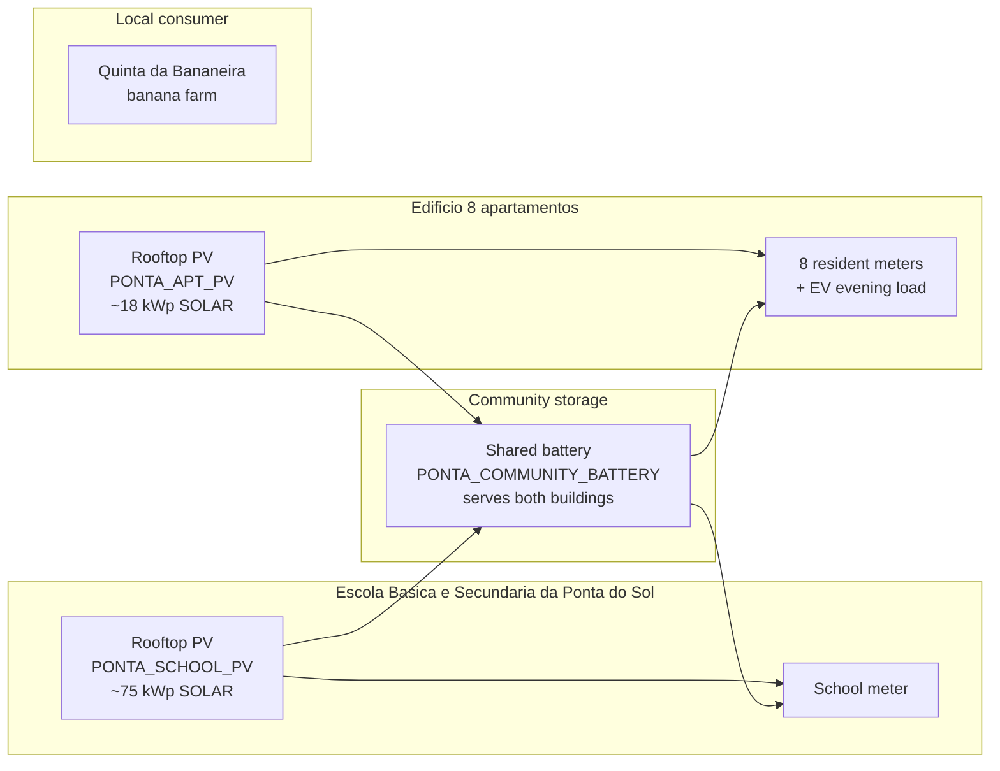

# Ponta do Sol — Demo Energy Community Setup

Set up a production Base mainnet demo space **Ponta do Sol** for investor and community showcases: create the Hypha space via UI, activate EnergyPPAv2 via governance proposal (2 rooftop PV + 1 shared battery), then seed Neon metadata and Azure interval telemetry via scripts.

## Recommendation at a glance

| Step | UI (you) | Scriptable (agent + DB URLs) |
|------|----------|------------------------------|
| Create Hypha space on Base | **Yes — required** | PG row only possible, but misses wallet signing |
| Upload branding images | **Yes** (or provide URLs) | Update `logoUrl` / `leadImage` in Neon after upload |
| Enable Energy Community | **Yes — governance proposal** | Direct `deployCommunity` script bypasses executor linkage; not recommended on prod |
| Whitelist settlement wallet | Proposal or Hardhat script | Scriptable post-activation |
| Seed 15-min energy telemetry | No | **Yes** — Azure PG `accounting.interval_readings` |
| Space metadata / location | Partial UI | **Yes** — Neon `spaces` update script |

**Bottom line:** On production, use the **UI for on-chain actions** (space + energy activation proposals). Use **scripts** for metadata polish and realistic interval data once DB connection strings are available.

---

## Part 1 — Technical setup

### Architecture



### Phase A — Create the Hypha space (UI)

1. Open [app.hypha.earth](https://app.hypha.earth) → **Create Space** (or onboarding flow).
2. Suggested fields:

| Field | Value |
|-------|-------|
| Title | `Ponta do Sol Energy Community` |
| Slug | `ponta-do-sol-energy-community` *(deployed; UI may auto-append suffix if `ponta-do-sol` was taken)* |
| Description | Ponta do Sol pools rooftop solar from school and apartments in one shared community. By day, school surplus supplies the banana farm. By evening, a shared 150 kWh battery—charged from both roofs at midday—supports apartment EV charging. School, residents, and investors co-own each asset. *(292 chars)* |
| Activation mode | **Pilot** (`demo` flag) — visible for demos, not full public launch |
| Location | Ponta do Sol, Madeira (~`32.6897`, `-17.1042`) |
| Categories | Energy / Community (as available) |
| Governance defaults | Keep orchestrator defaults (`quorum=50`, `unity=80`) unless you want faster solo voting |

3. Note the resulting **`web3SpaceId`** and **executor address** from the space settings / treasury after creation.

**Description length:** Create/Edit Space UI validates **max 300 characters** via `packages/core/src/space/validation.ts`. PostgreSQL `spaces.description` is unbounded `text`, so a direct Neon script can store a longer pitch — but editing in the UI later enforces 300 again.

**Why UI, not script:** `useCreateSpaceOrchestrator` requires a Privy smart wallet signature. `create-space-test.ts` can deploy on-chain with a private key but does not produce a complete Hypha experience without manual PG linking.

### Phase B — Enable Energy Community (UI governance)

Path: Space → **Create Action** → **Enable Energy Community**  
Form: `packages/epics/src/governance/components/create-enable-energy-community-form.tsx`

#### Proposal title

`Enable Energy Community — Ponta do Sol`

#### Proposal content (paste into **Proposal Content** field)

```markdown
This proposal activates the Ponta do Sol energy community on Base mainnet via EnergyPPAv2.

It registers rooftop solar on **Escola Básica e Secundária da Ponta do Sol** and the apartment block, a shared 150 kWh battery, eight households, Quinta da Bananeira, and two individual investors (Vlad Hramtsov, Suzana Souza) — with on-chain ownership and automated settlement.
```

Correct Portuguese spelling: **Básica**, **Secundária**, lowercase **e**, **da Ponta do Sol**.

1. Submit proposal with Part 2 form values (see ownership and members below; full copy-paste wallet doc TBD).
2. Set **voting duration = 0** if you are the sole voter initially.
3. Vote and execute — executor calls `EnergyPPAv2Factory.deployCommunity`.
4. Verify sync: `GET /api/v1/spaces/ponta-do-sol-energy-community/energy` returns `enabled: true` with `factoryCommunityId` (requires space auth if demo flag is private).

**Post-activation proposals (can follow later):**

- **Whitelist Energy Settlement** — authorize backend ops wallet for `consumeEnergy`
- **Add Energy Member** — when real Hypha users join with their smart wallet addresses

### Phase C — Scriptable work (when DB URLs are provided)

#### C1. Neon PostgreSQL (`DATABASE_URL`)

Update `spaces` row for `ponta-do-sol-energy-community`:

- `logoUrl`, `leadImage`, `description`, `links`
- **Full description** (Neon — operational): *"Ponta do Sol is a Madeira village energy community. Escola Básica e Secundária da Ponta do Sol and the apartment block each host rooftop solar; a 150 kWh battery shared between both buildings stores midday surplus. During daylight hours, excess school generation supplies Quinta da Bananeira. In the evening, stored energy supports apartment EV charging. The school co-owns its rooftop with two investors; apartment residents co-own their rooftop with the same investors; the battery is co-owned by school, residents, and investors. The municipality receives community fees."*
- `latitude`, `longitude`, `locationLabel` = "Ponta do Sol, Madeira, Portugal"
- `flags` = `["demo"]`

#### C2. Azure energy DB (`ENERGY_DB_*` env vars)

Seed `accounting.interval_readings` using the meter IDs and `community_id` in **Part 3 — Backend developer handoff** below. See also `packages/storage-evm/ENERGY_INTERVAL_DATA_FEED.md` for row shape and examples.

Run settlement loop:

```bash
cd packages/storage-evm
ENERGY_DEMO_COMMAND=loop npx hardhat run scripts/base-mainnet-contracts-scripts/energy-ppav2-rds-loop.ts --network base-mainnet
```

#### C3. Demo wallet generation

Generate **~15 team-controlled addresses** (see `energy-ppav2-mainnet-demo.ts` for pattern):

- **Institutional:** `communityTreasury`, `escolaPontaDoSol`, `bananaFarm`, `gridOperator`, `hyphaAggregator`
- **8 individual residents:** `resident01` … `resident08`
- **2 individual investors:** `investorVlad`, `investorSuzana`
- Store in `ponta-do-sol-demo-wallets.json` (gitignored) — **never commit private keys**

### What is NOT possible / not recommended

- Fully headless prod setup without any wallet signatures
- Replacing governance activation with raw `deployCommunity` on prod (breaks executor admin discovery in `apps/web/src/app/api/v1/spaces/[spaceSlug]/energy/route.ts`)
- Creating Privy accounts for demo wallets (they exist only as on-chain addresses for settlement demo)

---

## Part 2 — Ownership structure and members

### Narrative (investor-facing)

Ponta do Sol is a **village-scale local energy community** in Madeira. **Each building has its own rooftop solar** (east–west flat-roof arrays); generation is registered as separate on-chain sources:

- **Community shared battery** — single storage asset serving both school and apartment; charged from school PV midday surplus and apartment PV surplus; discharges for apartment evening EV load
- **Edifício de Apartamentos** (8 homes) — own rooftop PV (~18 kWp); hosts the shared battery and most evening load
- **Escola Básica e Secundária da Ponta do Sol** — own rooftop PV (~75 kWp); surplus feeds shared battery, banana farm, and export
- **Quinta da Bananeira** — consumer only (no rooftop); daytime agricultural load
- **Two individual investors** — Vlad Hramtsov and Suzana Souza, co-investors in PV and battery
- **Eight individual apartment residents** — Sofia Costa, Miguel Pereira, Ana Rodrigues, João Ferreira, Inês Sousa, Beatriz Silva, Pedro Freire, Rogério Ivan (each with own meter and ownership stake)
- **Município / community treasury** — receives community fee (5%); no source ownership tokens

### On-site generation assets (2 rooftop PV + 1 shared battery)



| Source ID (form **Name**) | Token / display name (form **Token name**) | Type | Current price / kWh |
|---------------------------|--------------------------------------------|------|---------------------|
| `PONTA_SCHOOL_PV` | Ponta do Sol School Solar | SOLAR | `0.10` |
| `PONTA_APT_PV` | Ponta Apartment Solar | SOLAR | `0.10` |
| `PONTA_COMMUNITY_BATTERY` | Ponta Community Battery | BATTERY | `0.15` |

| Source | Demo size | Est. production / role |
|--------|-----------|------------------------|
| School PV | 75 kWp | ~110,000 kWh/yr |
| Apartment PV | ~18 kWp | ~26,000 kWh/yr |
| Shared battery | ~150 kWh | shifts ~15–20 MWh/yr |

### Community energy balance (annual, planning-level)

| | kWh/yr |
|---|--:|
| **Production** — school PV | ~110,000 |
| **Production** — apartment PV | ~26,000 |
| **Total generation** | **~136,000** |
| School consumption | ~22,000 |
| 8 apartments (incl. AC + EV) | ~46,000 |
| Banana farm (daytime agricultural) | ~18,000 |
| **Total demand** | **~86,000** |
| **Net community surplus** | **~50,000** |

**Investor pitch line:** *"The school roof powers the village — surplus solar runs the banana farm by day, stores energy for apartment EVs by night."*

### Ownership split (basis points, total 10,000 per source)

No municipality on source tokens (municipality only receives the 5% community fee at settlement).

**Escola Básica e Secundária da Ponta do Sol rooftop PV** — school wallet + two investors:

| Holder | % | BPS |
|--------|---|-----|
| Escola Básica e Secundária da Ponta do Sol (institutional wallet) | 50% | 5,000 |
| Vlad Hramtsov (individual investor) | 25% | 2,500 |
| Suzana Souza (individual investor) | 25% | 2,500 |

**Apartment rooftop PV** — eight households + two investors:

| Holder | % | BPS |
|--------|---|-----|
| Sofia Costa | 8% | 800 |
| Miguel Pereira | 7% | 700 |
| Ana Rodrigues | 5% | 500 |
| João Ferreira | 5% | 500 |
| Inês Sousa | 6% | 600 |
| Beatriz Silva | 10% | 1,000 |
| Pedro Freire | 10% | 1,000 |
| Rogério Ivan | 9% | 900 |
| Vlad Hramtsov (individual investor) | 20% | 2,000 |
| Suzana Souza (individual investor) | 20% | 2,000 |

**Community shared battery** — school + eight households + two investors:

| Holder | % | BPS |
|--------|---|-----|
| Escola Básica e Secundária da Ponta do Sol (institutional wallet) | 30% | 3,000 |
| Sofia Costa | 5% | 500 |
| Miguel Pereira | 5% | 500 |
| Ana Rodrigues | 5% | 500 |
| João Ferreira | 5% | 500 |
| Inês Sousa | 5% | 500 |
| Beatriz Silva | 5% | 500 |
| Pedro Freire | 5% | 500 |
| Rogério Ivan | 5% | 500 |
| Vlad Hramtsov (individual investor) | 15% | 1,500 |
| Suzana Souza (individual investor) | 15% | 1,500 |

| Asset | Owners |
|-------|--------|
| School PV | Escola (wallet), Vlad, Suzana |
| Apartment PV | 8 residents, Vlad, Suzana |
| Shared battery | Escola (wallet), 8 residents, Vlad, Suzana |

**Rationale — school PV at 50%:** The array is on the school roof and the school is the primary operational beneficiary (lower bills + revenue share). Investors at 25% each provide capital while the school retains majority ownership of its own asset.

### Alternative scenario — RWA fund instead of individual investors

The **default demo** uses two named individuals (**Vlad Hramtsov**, **Suzana Souza**) as co-investors. An alternative pitch treats generation assets as **real-world assets (RWAs)** wrapped in a fund-like vehicle, where external investors buy units and receive **cash yield** from community energy settlement (similar to interest / coupon on production revenues).

#### Legal vehicle options (EU / Portugal)

| Vehicle | Best for | Notes |
|---------|----------|-------|
| **SPV** (e.g. Portuguese *sociedade por quotas*) | Single asset or small portfolio | SPV holds `RegularSpaceToken` shares; investors buy tokenized equity or debt in the SPV. Simplest for a pilot. |
| **Energy cooperative** (*cooperativa de energia*) | Community members + local LPs | Strong fit for RED II / local energy communities; one member wallet replaces Vlad + Suzana. |
| **AIF** (Alternative Investment Fund) | Professional / qualified investors | Regulated wrapper; on-chain tokens map to fund units. Higher setup cost. |
| **ELTIF 2.0** | Retail, long-term (EU) | Allows broader investor access to illiquid infrastructure; long onboarding. |

**Hypha on-chain layer:** Unchanged — the fund is a **single wallet address** (or SPV treasury) listed as ownership-token holder and settlement recipient, replacing the two individual investor rows. `RegularSpaceToken` revenue still flows pro-rata to holders; the fund distributes to LPs off-chain or via a tokenized share class.

#### Example fund ownership (mirrors individual scenario economics)

| Asset | School / residents | **Ponta do Sol Energy Fund** (replaces Vlad + Suzana) |
|-------|-------------------|-----------------------------------------------------|
| School PV | School **50%** | Fund **50%** |
| Apartment PV | 8 residents **30%** | Fund **70%** |
| Shared battery | School **10%** + residents **20%** | Fund **70%** |

Energy members: replace investor rows 11–12 with one **Fund treasury** member (sentinel device ID, revenue only).

#### Realistic ROI estimate (planning-level)

Assumptions for Ponta do Sol scale:

- School PV **75 kWp**, ~**110 MWh/yr**; apartment PV **18 kWp**, ~**26 MWh/yr**; battery **150 kWh**
- Settlement reference **€0.10/kWh** (solar), **€0.15/kWh** (battery dispatch)
- Installed cost order-of-magnitude: **€70k** school array, **€20k** apartment array, **€60k** battery (incl. BOS) → **~€150k** total
- Fund finances **~70% of investor-side capital** (~€50–60k deployed across assets)
- Community fee **5%** + aggregator **3%** deducted before source revenue
- **0.5%/yr** degradation; **1%/yr** O&M on CAPEX

**Simplified fund revenue (investor share of settlement, year 1):**

| Source | Fund ownership | Est. fund revenue share |
|--------|----------------|-------------------------|
| School PV | 50% of source | ~€4,500–5,500/yr |
| Apartment PV | 70% of source | ~€1,400–1,700/yr |
| Battery | 70% of source | ~€800–1,500/yr (usage-dependent) |
| **Total to fund** | | **~€7,000–8,500/yr** |

On **~€55k** fund capital deployed → **~12–15% gross cash yield** in year 1 (high because school surplus dominates).

**More realistic blended net targets** after fees, O&M, curtailment, and not all MWh settling at full tariff:

| Metric | Range | Comment |
|--------|-------|---------|
| **Year 1–5 cash yield** | **7–10%** | Strong school surplus + local offtake (farm, apartments) |
| **10-year average net yield** | **6–8%** | Degradation + battery replacement reserve |
| **15-year project IRR (equity)** | **7–9%** | Typical for sub-MW EU community solar |
| **Debt-like coupon (senior tranche)** | **5–7%** | If structured as loan to SPV backed by PPA/settlement cash flows |

**How to pitch it to investors:**

- **Equity / revenue-share (Hypha default):** Variable yield tied to production and community consumption — **target 7–9% net**, upside if export prices improve.
- **Fixed-income style:** Senior note on school PV SPV only (stable school + farm offtake) — **5–6% coupon**; lower risk, lower return.
- **Not a bank deposit:** Yield depends on sun, consumption, and settlement; illiquid; regulatory wrapper required for public retail.

**Demo recommendation:** Keep **individual investors** for the live Hypha demo (human-readable cap table). Use the **fund scenario** in investor slides as the RWA scale-up story: *"Replace two wallets with one regulated SPV; same on-chain settlement, tokenized fund units, 7–9% target net yield."*

### Energy members (settlement accounts)

**12 member rows** — device IDs **as deployed on-chain** (community `2`):

| # | Role | device ID | Member wallet |
|---|------|-----------|---------------|
| 1 | Apartment resident | `1` | `0x1E7333eBEFa2CBd17b06AE2d88008Af914750732` |
| 2 | Apartment resident | `2` | `0xCdc96173d473FEE6ce356e6E0E6121ff486D9024` |
| 3 | Apartment resident | `3` | `0xB8566cBD813a286B21af8CEd83373073b536D7A3` |
| 4 | Apartment resident | `4` | `0x0676AacA620FD9611d1a51af6b54E5b7027Df580` |
| 5 | Apartment resident | `5` | `0xd0156d4aEb966f555F75E2241F6C7Cbee94c4f03` |
| 6 | Apartment resident | `6` | `0x7223bCEF39CFebec0f3dC0388e57E247D6e4Ac79` |
| 7 | **Escola da Ponta do Sol** (school) | **`7`** | `0x1092b8538fCFe579aBE55d81EEc8F8A5Fee0a3Be` |
| 8 | **Quinta da Bananeira** (banana farm) | **`8`** | `0x528A45E8EfEDF33dCD239682aa8652EE9CcF0b66` |
| 9 | Apartment resident | `9` | `0x9D8D70573e4f186A564a6f2517C944E445a3d3f6` |
| 10 | Apartment resident | `10` | `0x746B118a33A55C711e2dD88564d994957b89Ab55` |
| 11 | Vlad Hramtsov (investor) | *(none)* | `0xE27F33cA8037A2B0F4D3d4F9B8CcD896c2674484` |
| 12 | Suzana Souza (investor) | *(none)* | `0x6Fa7884B440054Fdf7797DE7f87Ce9Af43fFC691` |

*Planned proposal copy used meter `1` = school and meter `10` = farm; the executed form assigned different device IDs. Backend telemetry must follow the deployed table above.*

### Fees and operators

| Field | Suggested address | Value |
|-------|-------------------|-------|
| Admin | Space executor (auto) | — |
| Stablecoin | Base USDC | `0x833589fCD6eDb6E08f4c7C32D4f71b54bdA02913` |
| Community fee recipient | `communityTreasury` wallet | 500 BPS (5%) |
| Aggregator fee recipient | Hypha ops wallet | 300 BPS (3%) |
| Grid operator | `gridOperator` demo wallet | For export credits |
| Export device ID | `9999` | Standard demo convention |
| Energy token | `PDS Energy` / `PDSE` | Madeira branding |

### Optimization (form defaults)

- Purpose ranking: `SELF_CONSUMPTION` first
- Social mode: `VARIABLE` with small allocation to community treasury

---

## Part 3 — Backend developer handoff (interval telemetry)

Use this section when generating 15-minute demo data for Azure PostgreSQL (`accounting.interval_readings`) and running the settlement loop. **Do not start seeding until the Enable Energy Community proposal has executed** — you need the on-chain `factoryCommunityId` first.

### Community identifier

Every interval row must use the same numeric **`community_id`**. For Ponta do Sol this equals the on-chain **`factoryCommunityId`** assigned by `EnergyPPAv2Factory.deployCommunity` (a sequential factory index: `0`, `1`, `2`, … — not the Hypha space ID or slug).

**Deployed (2026-07-14, Base mainnet):**

| Field | Value |
|-------|-------|
| Hypha space slug | `ponta-do-sol-energy-community` |
| Hypha space ID (PG) | `775` |
| On-chain space ID (`web3SpaceId`) | `1132` |
| Space wallet / PPA admin | `0xE3885bcfA73538a1737815bc9597598fbf8b6E7a` |
| **`community_id` / `factoryCommunityId`** | **`2`** |
| PPA proxy | `0xf0c6659841f1D7080e68140cEbB28ba972cB469B` |
| Energy token | `0x46bC7A3072a44A03a89b4017eaC00019e0E26D21` |
| Factory | `0x5F07320B3C95C6fB0A0D77d707F14aC95A897E90` |
| Deployed at (UTC) | `2026-07-14T15:21:31Z` |
| Network | Base mainnet (chain ID `8453`) |
| Interval cadence | 15 minutes, UTC quarter-hour boundaries |
| Target table | `accounting.interval_readings` |

```text
PONTA_DO_SOL_COMMUNITY_ID=2
ENERGY_COMMUNITY_ID=2
```

Set `ENERGY_COMMUNITY_ID=2` in the settlement loop env — see `energy-ppav2-rds-loop.ts`.

**Re-verify if needed:**

1. **API:** `GET https://app.hypha.earth/api/v1/spaces/ponta-do-sol-energy-community/energy` → `activation.factoryCommunityId` *(auth required for this demo space)*
2. **Neon:** `SELECT factory_community_id FROM energy_communities ec JOIN spaces s ON s.id = ec.space_id WHERE s.slug = 'ponta-do-sol-energy-community' ORDER BY ec.created_at DESC LIMIT 1;`
3. **On-chain:** `EnergyPPAv2Factory.getAdminCommunities(0xE3885bcfA73538a1737815bc9597598fbf8b6E7a)` → `[2]`

### Meter ID inventory (summary)

| Category | Count | meter_id(s) | Send interval rows? |
|----------|------:|-------------|---------------------|
| **School** (institutional consumer) | 1 | **`7`** | Yes — `direction: consumption` |
| **Apartment residents** (8 households) | 8 | **`1`–`6`, `9`, `10`** | Yes — `direction: consumption` |
| **Banana farm** (institutional consumer) | 1 | **`8`** | Yes — `direction: consumption` |
| **Production sources** (PV + battery) | 3 | `9001`, `9002`, `9003` | Yes — `direction: production` |
| **Grid export** | 1 | `9999` | **No** — computed and written by the VPP / settlement loop |
| **Investors** (revenue-only, no meters) | 0 | `9101`, `9102` | **No** — sentinel on-chain device IDs only |

**Totals for your ingest job:**

- **10 consumption meters** to seed every interval: school **`7`**, farm **`8`**, apartments **`1`–`6`, `9`, `10`**
- **3 production meters** to seed every interval (`9001`–`9003`)
- **13 meter IDs** you generate data for; **`9999` is not pre-seeded**

Per interval you typically insert **13 rows** (10 consumption + 3 production), all with the same `community_id` and `interval_start`.

### Consumption meters — full registry (as deployed on-chain)

**Important:** The proposal *design* used meter `1` = school and meter `10` = banana farm. The **executed** deployment registered different device IDs. Telemetry and settlement **must** use the on-chain IDs below (verified from PPA `0xf0c6659841f1D7080e68140cEbB28ba972cB469B`, community `2`).

| meter_id | Category | Wallet | Notes |
|---------:|----------|--------|-------|
| **7** | **School** | `0x1092b8538fCFe579aBE55d81EEc8F8A5Fee0a3Be` | Escola da Ponta do Sol subspace wallet. Daytime school load; lower evening use. |
| **8** | **Banana farm** | `0x528A45E8EfEDF33dCD239682aa8652EE9CcF0b66` | Quinta da Bananeira subspace wallet. **Daytime-heavy** agricultural load. |
| **1** | Apartment | `0x1E7333eBEFa2CBd17b06AE2d88008Af914750732` | Resident (Hypha smart wallet) |
| **2** | Apartment | `0xCdc96173d473FEE6ce356e6E0E6121ff486D9024` | Resident |
| **3** | Apartment | `0xB8566cBD813a286B21af8CEd83373073b536D7A3` | Resident |
| **4** | Apartment | `0x0676AacA620FD9611d1a51af6b54E5b7027Df580` | Resident |
| **5** | Apartment | `0xd0156d4aEb966f555F75E2241F6C7Cbee94c4f03` | Resident |
| **6** | Apartment | `0x7223bCEF39CFebec0f3dC0388e57E247D6e4Ac79` | Resident |
| **9** | Apartment | `0x9D8D70573e4f186A564a6f2517C944E445a3d3f6` | Resident |
| **10** | Apartment | `0x746B118a33A55C711e2dD88564d994957b89Ab55` | Resident |

**Quick lookup (deployed):**

- **School:** meter **`7`** — *not* meter `1`
- **Banana farm:** meter **`8`** — *not* meter `10`
- **Apartments:** meters **`1`, `2`, `3`, `4`, `5`, `6`, `9`, `10`**

Investors (`0xE27F33cA8037A2B0F4D3d4F9B8CcD896c2674484`, `0x6Fa7884B440054Fdf7797DE7f87Ce9Af43fFC691`) have **no consumption meters** on-chain — revenue-only members.

### Production meters — mapping to on-chain sources

These numeric IDs are for the **Azure ingest / VPP layer**. Map them to on-chain source IDs in backend config (`productionDeviceToSource` or equivalent):

| meter_id | On-chain source name (form **Name**) | Asset | Typical `direction` |
|---------:|--------------------------------------|-------|---------------------|
| **9001** | `PONTA_SCHOOL_PV` | School rooftop solar (~75 kWp) | `production` |
| **9002** | `PONTA_APT_PV` | Apartment rooftop solar (~18 kWp) | `production` |
| **9003** | `PONTA_COMMUNITY_BATTERY` | Shared 150 kWh battery (discharge = production to grid/load) | `production` |

After activation, resolve bytes32 source IDs from `GET /api/v1/spaces/ponta-do-sol-energy-community/energy` (`sources[].sourceId`) or from PPA `0xf0c6659841f1D7080e68140cEbB28ba972cB469B` — do not hard-code demo community `0` IDs from `ENERGY_INTERVAL_DATA_FEED.md`.

### Interval row shape

```ts
type IntervalReading = {
  interval_start: string;   // ISO-8601 UTC, e.g. "2026-07-14T12:00:00Z"
  meter_id: number;
  community_id: number;     // = factoryCommunityId for ponta-do-sol
  energy_wh: number;        // integer watt-hours for the 15-min bucket
  direction: 'consumption' | 'production' | 'import';
};
```

Example — one interval, school (meter 7) + one apartment + school PV:

```json
[
  {
    "interval_start": "2026-07-14T12:00:00Z",
    "meter_id": 7,
    "community_id": 2,
    "energy_wh": 4500,
    "direction": "consumption"
  },
  {
    "interval_start": "2026-07-14T12:00:00Z",
    "meter_id": 2,
    "community_id": 2,
    "energy_wh": 1200,
    "direction": "consumption"
  },
  {
    "interval_start": "2026-07-14T12:00:00Z",
    "meter_id": 9001,
    "community_id": 2,
    "energy_wh": 18500,
    "direction": "production"
  }
]
```

### Realistic load patterns (demo narrative)

Use Part 2 annual balance as a sanity check (~136 MWh/yr generation, ~86 MWh/yr demand):

| meter_id | Pattern hint |
|---------:|--------------|
| **7** (school) | Higher weekdays 08:00–17:00; minimal nights/weekends |
| **1–6, 9, 10** (apartments) | Evening peaks (18:00–23:00), AC in summer; some EV charging after battery discharge |
| **8** (farm) | **Daytime only** — align surplus school PV to mid-day farm load |
| 9001 (school PV) | Peak mid-day; east–west array → broader plateau than single-orientation |
| 9002 (apt PV) | Mid-day peak; smaller nameplate than school |
| 9003 (battery) | `production` rows when discharging; charge periods may show as lower net export elsewhere — match VPP expectations |

### Settlement loop

After rows are in Azure PG:

```bash
cd packages/storage-evm
ENERGY_COMMUNITY_ID=2 \
ENERGY_DEMO_COMMAND=loop \
npx hardhat run scripts/base-mainnet-contracts-scripts/energy-ppav2-rds-loop.ts --network base-mainnet
```

Ensure the ops wallet calling `consumeEnergy` is **whitelisted** on the Ponta PPA proxy. Reference: `energy-ppav2-rds-loop.ts`, `docs/energy-community-initiation-ui-flow.md`.

---

## Execution order

1. Generate demo wallet manifest + UI copy-paste doc
2. Create space in UI (`ponta-do-sol-energy-community`, pilot/demo, location)
3. Submit + pass Enable Energy Community proposal
4. Share `DATABASE_URL` and `ENERGY_DB_*` connection; confirm `factoryCommunityId` (Part 3)
5. Neon metadata script + Azure interval seed (Part 3 meter IDs) + checkpoint state file
6. Whitelist + run one settlement interval; verify Energy tab
7. Optional: Add Energy Member proposals as real users onboard

---

## Related docs

- [`README-energy-demo-enable-energy-community-ui.md`](../packages/storage-evm/README-energy-demo-enable-energy-community-ui.md)
- [`ENERGY_INTERVAL_DATA_FEED.md`](../packages/storage-evm/ENERGY_INTERVAL_DATA_FEED.md)
- [`docs/energy-community-initiation-ui-flow.md`](./energy-community-initiation-ui-flow.md)
