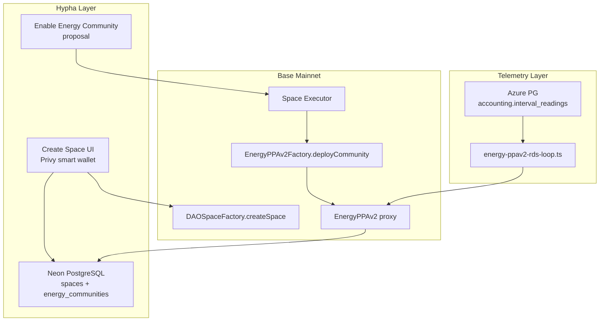
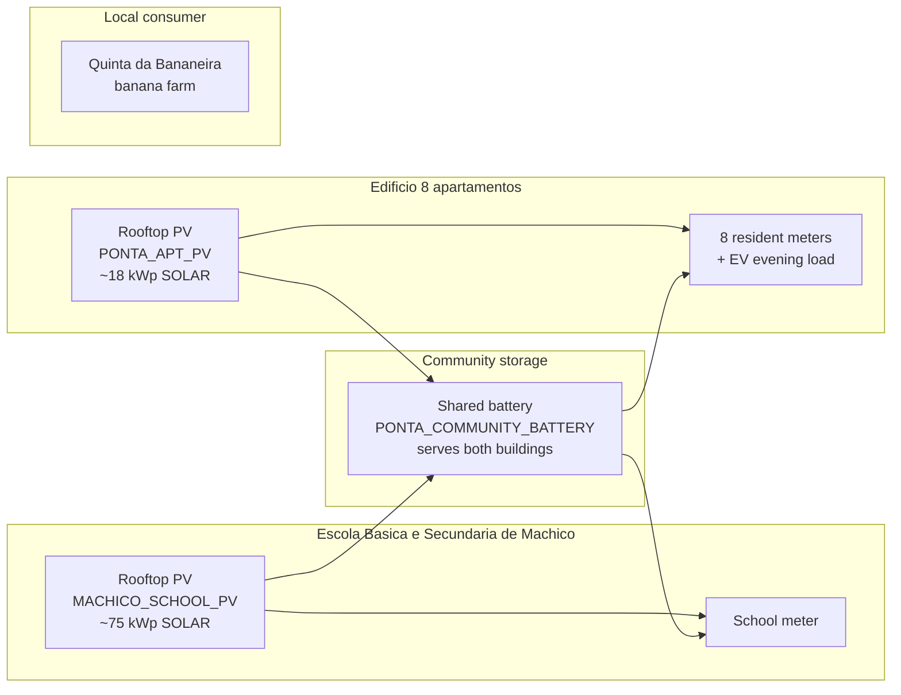

# Ponta do Sol — Demo Energy Community Setup

Set up a production Base mainnet demo space **Ponta do Sol** for investor and community showcases: create the Hypha space via UI, activate EnergyPPAv2 via governance proposal (2 rooftop PV + 1 shared battery), then seed Neon metadata and Azure interval telemetry via scripts.

## Recommendation at a glance

| Step | UI (you) | Scriptable (agent + DB URLs) |
|------|----------|------------------------------|
| Create Hypha space on Base | **Yes — required** | PG row only possible, but misses wallet signing |
| Upload branding images | **Yes** (or provide URLs) | Update `logoUrl` / `leadImage` in Neon after upload |
| Enable Energy Community | **Yes — governance proposal** | Direct `deployCommunity` script bypasses executor linkage; not recommended on prod |
| Whitelist settlement wallet | Proposal or Hardhat script | Scriptable post-activation |
| Seed 15-min energy telemetry | No | **Yes** — Azure PG `accounting.interval_readings` |
| Space metadata / location | Partial UI | **Yes** — Neon `spaces` update script |

**Bottom line:** On production, use the **UI for on-chain actions** (space + energy activation proposals). Use **scripts** for metadata polish and realistic interval data once DB connection strings are available.

---

## Part 1 — Technical setup

### Architecture



### Phase A — Create the Hypha space (UI)

1. Open [app.hypha.earth](https://app.hypha.earth) → **Create Space** (or onboarding flow).
2. Suggested fields:

| Field | Value |
|-------|-------|
| Title | `Ponta do Sol Energy Community` |
| Slug | `ponta-do-sol` |
| Description | Ponta do Sol pools rooftop solar from school and apartments in one shared community. By day, school surplus supplies the banana farm. By evening, a shared 150 kWh battery—charged from both roofs at midday—supports apartment EV charging. School, residents, and investors co-own each asset. *(292 chars)* |
| Activation mode | **Pilot** (`demo` flag) — visible for demos, not full public launch |
| Location | Ponta do Sol, Madeira (~`32.6897`, `-17.1042`) |
| Categories | Energy / Community (as available) |
| Governance defaults | Keep orchestrator defaults (`quorum=50`, `unity=80`) unless you want faster solo voting |

3. Note the resulting **`web3SpaceId`** and **executor address** from the space settings / treasury after creation.

**Description length:** Create/Edit Space UI validates **max 300 characters** via `packages/core/src/space/validation.ts`. PostgreSQL `spaces.description` is unbounded `text`, so a direct Neon script can store a longer pitch — but editing in the UI later enforces 300 again.

**Why UI, not script:** `useCreateSpaceOrchestrator` requires a Privy smart wallet signature. `create-space-test.ts` can deploy on-chain with a private key but does not produce a complete Hypha experience without manual PG linking.

### Phase B — Enable Energy Community (UI governance)

Path: Space → **Create Action** → **Enable Energy Community**  
Form: `packages/epics/src/governance/components/create-enable-energy-community-form.tsx`

#### Proposal title

`Enable Energy Community — Ponta do Sol`

#### Proposal content (paste into **Proposal Content** field)

```markdown
This proposal activates the Ponta do Sol energy community on Base mainnet via EnergyPPAv2.

It registers rooftop solar on **Escola Básica e Secundária de Machico** and the apartment block, a shared 150 kWh battery, eight households, Quinta da Bananeira, and two individual investors — with on-chain ownership and automated settlement.
```

Correct Portuguese spelling: **Básica**, **Secundária**, lowercase **e**. Machico is the school location; Ponta do Sol remains the community name.

1. Submit proposal with Part 2 form values (see ownership and members below; full copy-paste wallet doc TBD).
2. Set **voting duration = 0** if you are the sole voter initially.
3. Vote and execute — executor calls `EnergyPPAv2Factory.deployCommunity`.
4. Verify sync: `GET /api/v1/spaces/ponta-do-sol/energy` returns `enabled: true` with `factoryCommunityId`.

**Post-activation proposals (can follow later):**

- **Whitelist Energy Settlement** — authorize backend ops wallet for `consumeEnergy`
- **Add Energy Member** — when real Hypha users join with their smart wallet addresses

### Phase C — Scriptable work (when DB URLs are provided)

#### C1. Neon PostgreSQL (`DATABASE_URL`)

Update `spaces` row for `ponta-do-sol`:

- `logoUrl`, `leadImage`, `description`, `links`
- **Full description** (Neon — operational): *"Ponta do Sol is a Madeira village energy community. Escola Básica e Secundária de Machico and the apartment block each host rooftop solar; a 150 kWh battery shared between both buildings stores midday surplus. During daylight hours, excess school generation supplies Quinta da Bananeira. In the evening, stored energy supports apartment EV charging. The school co-owns its rooftop with two investors; apartment residents co-own their rooftop with the same investors; the battery is co-owned by school, residents, and investors. The municipality receives community fees."*
- `latitude`, `longitude`, `locationLabel` = "Ponta do Sol, Madeira, Portugal"
- `flags` = `["demo"]`

#### C2. Azure energy DB (`ENERGY_DB_*` env vars)

Per `packages/storage-evm/ENERGY_INTERVAL_DATA_FEED.md`, seed `accounting.interval_readings`:

| meter_id | Role |
|---------:|------|
| 1 | Escola Básica e Secundária de Machico (consumption) |
| 2–9 | 8 individual apartment residents (1 meter each) |
| 10 | Quinta da Bananeira (banana farm) |
| 9001 | Escola Básica e Secundária de Machico rooftop PV |
| 9002 | Apartment rooftop PV production |
| 9003 | Community shared battery (school + apartment) |
| 9999 | Grid export (computed by VPP) |

Run settlement loop:

```bash
cd packages/storage-evm
ENERGY_DEMO_COMMAND=loop npx hardhat run scripts/base-mainnet-contracts-scripts/energy-ppav2-rds-loop.ts --network base-mainnet
```

#### C3. Demo wallet generation

Generate **~15 team-controlled addresses** (see `energy-ppav2-mainnet-demo.ts` for pattern):

- **Institutional:** `communityTreasury`, `escolaMachico`, `bananaFarm`, `gridOperator`, `hyphaAggregator`
- **8 individual residents:** `resident01` … `resident08`
- **2 individual investors:** `investorAna`, `investorJoao`
- Store in `ponta-do-sol-demo-wallets.json` (gitignored) — **never commit private keys**

### What is NOT possible / not recommended

- Fully headless prod setup without any wallet signatures
- Replacing governance activation with raw `deployCommunity` on prod (breaks executor admin discovery in `apps/web/src/app/api/v1/spaces/[spaceSlug]/energy/route.ts`)
- Creating Privy accounts for demo wallets (they exist only as on-chain addresses for settlement demo)

---

## Part 2 — Ownership structure and members

### Narrative (investor-facing)

Ponta do Sol is a **village-scale local energy community** in Madeira. **Each building has its own rooftop solar** (east–west flat-roof arrays); generation is registered as separate on-chain sources:

- **Community shared battery** — single storage asset serving both school and apartment; charged from school PV midday surplus and apartment PV surplus; discharges for apartment evening EV load
- **Edifício de Apartamentos** (8 homes) — own rooftop PV (~18 kWp); hosts the shared battery and most evening load
- **Escola Básica e Secundária de Machico** — own rooftop PV (~75 kWp); surplus feeds shared battery, banana farm, and export
- **Quinta da Bananeira** — consumer only (no rooftop); daytime agricultural load
- **Two individual investors** — private citizens who co-invested in PV and battery
- **Eight individual apartment residents** — each with own meter and ownership stake in apartment PV + shared battery
- **Município / community treasury** — receives community fee (5%); no source ownership tokens

### On-site generation assets (2 rooftop PV + 1 shared battery)



| Source | Location | Type | Demo size | Est. production / role | Base price |
|--------|----------|------|-----------|------------------------|------------|
| `MACHICO_SCHOOL_PV` | Escola Básica e Secundária de Machico rooftop | SOLAR | 75 kWp | ~110,000 kWh/yr | €0.10/kWh |
| `PONTA_APT_PV` | Apartment rooftop | SOLAR | ~18 kWp | ~26,000 kWh/yr | €0.10/kWh |
| `PONTA_COMMUNITY_BATTERY` | Shared (school + apartment) | BATTERY | ~150 kWh | shifts ~15–20 MWh/yr | €0.15/kWh |

### Community energy balance (annual, planning-level)

| | kWh/yr |
|---|--:|
| **Production** — school PV | ~110,000 |
| **Production** — apartment PV | ~26,000 |
| **Total generation** | **~136,000** |
| School consumption | ~22,000 |
| 8 apartments (incl. AC + EV) | ~46,000 |
| Banana farm (daytime agricultural) | ~18,000 |
| **Total demand** | **~86,000** |
| **Net community surplus** | **~50,000** |

**Investor pitch line:** *"The Escola de Machico roof powers the village — surplus solar runs the banana farm by day, stores energy for apartment EVs by night."*

### Ownership split (basis points, total 10,000 per source)

No municipality on source tokens (municipality only receives the 5% community fee at settlement).

**Escola Básica e Secundária de Machico rooftop PV** — school + two investors:

| Holder | % | BPS |
|--------|---|-----|
| Escola Básica e Secundária de Machico | 20% | 2,000 |
| Ana Silva (individual investor) | 40% | 4,000 |
| João Mendes (individual investor) | 40% | 4,000 |

**Apartment rooftop PV** — eight households + two investors:

| Holder | % | BPS |
|--------|---|-----|
| 8 apartment residents (3.75% each) | 30% | 375 × 8 |
| Ana Silva (individual investor) | 35% | 3,500 |
| João Mendes (individual investor) | 35% | 3,500 |

**Community shared battery** — school + eight households + two investors:

| Holder | % | BPS |
|--------|---|-----|
| Escola Básica e Secundária de Machico | 10% | 1,000 |
| 8 apartment residents (2.5% each) | 20% | 250 × 8 |
| Ana Silva (individual investor) | 35% | 3,500 |
| João Mendes (individual investor) | 35% | 3,500 |

| Asset | Owners |
|-------|--------|
| School PV | Escola Básica e Secundária de Machico, Ana, João |
| Apartment PV | 8 residents, Ana, João |
| Shared battery | Escola Básica e Secundária de Machico, 8 residents, Ana, João |

### Energy members (settlement accounts)

**12 member rows**

| # | Role | device ID | Notes |
|---|------|-----------|-------|
| 1 | Escola Básica e Secundária de Machico | `1` | School consumption meter |
| 2–9 | Resident 1 … Resident 8 | `2`–`9` | 8 individual households |
| 10 | Quinta da Bananeira (banana farm) | `10` | Daytime irrigation, packing, cold storage |
| 11 | Ana Silva (individual investor) | `9101` | Revenue-only sentinel ID |
| 12 | João Mendes (individual investor) | `9102` | Revenue-only sentinel ID |

### Fees and operators

| Field | Suggested address | Value |
|-------|-------------------|-------|
| Admin | Space executor (auto) | — |
| Stablecoin | Base USDC | `0x833589fCD6eDb6E08f4c7C32D4f71b54bdA02913` |
| Community fee recipient | `communityTreasury` wallet | 500 BPS (5%) |
| Aggregator fee recipient | Hypha ops wallet | 300 BPS (3%) |
| Grid operator | `gridOperator` demo wallet | For export credits |
| Export device ID | `9999` | Standard demo convention |
| Energy token | `PDS Energy` / `PDSE` | Madeira branding |

### Optimization (form defaults)

- Purpose ranking: `SELF_CONSUMPTION` first
- Social mode: `VARIABLE` with small allocation to community treasury

---

## Execution order

1. Generate demo wallet manifest + UI copy-paste doc
2. Create space in UI (`ponta-do-sol`, pilot/demo, location)
3. Submit + pass Enable Energy Community proposal
4. Share `DATABASE_URL` and `ENERGY_DB_*` connection
5. Neon metadata script + Azure interval seed + checkpoint state file
6. Whitelist + run one settlement interval; verify Energy tab
7. Optional: Add Energy Member proposals as real users onboard

---

## Related docs

- [`README-energy-demo-enable-energy-community-ui.md`](../packages/storage-evm/README-energy-demo-enable-energy-community-ui.md)
- [`ENERGY_INTERVAL_DATA_FEED.md`](../packages/storage-evm/ENERGY_INTERVAL_DATA_FEED.md)
- [`docs/energy-community-initiation-ui-flow.md`](./energy-community-initiation-ui-flow.md)
