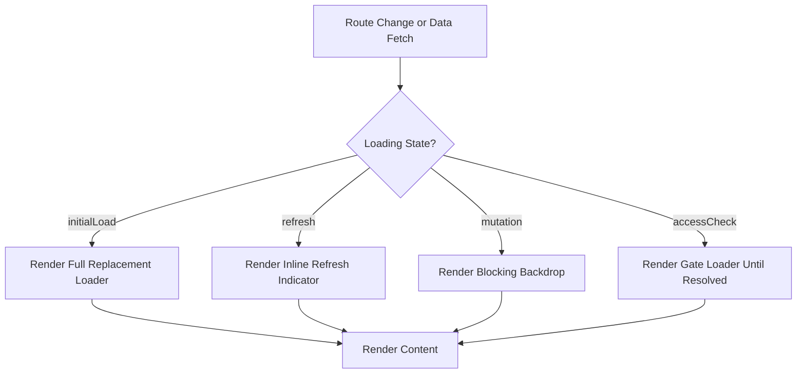

# Global Application Loader Specification

## Purpose

This document defines a unified loading UX standard across `apps/web` and `packages/epics` to eliminate the current problem of users seeing content beneath loaders during page transitions and data fetches.

---

## Problem Statement

Across the application, users frequently see the "component underneath" while loading indicators are active. This creates a jarring, unpolished experience. Root causes identified:

1. **Fail-open access gating** renders protected content before access checks resolve.
2. **Missing route-level loading boundaries** — `loading.tsx` coverage is sparse and concentrated in deep aside routes, with no broad boundaries at app/lang segments.
3. **Overlay-by-design loaders** (`LoadingBackdrop`) keep children mounted underneath with a translucent scrim, which is appropriate for mutations but not for initial data loads.
4. **SWR-driven screens** treat revalidation and initial load identically, keeping stale UI visible during background refreshes.

---

## Loading-State Taxonomy

| State | Definition | Visual Treatment |
|---|---|---|
| **Initial Load** | First data fetch; no cached data exists | Full replacement loader; no underlying content visible |
| **Background Refresh** | Revalidation with cached data still valid | Keep content visible + subtle inline indicator |
| **Mutation** | User-initiated action (submit, vote, create) | Blocking overlay (`LoadingBackdrop`) with progress |
| **Access Check** | Authentication/permission gate in progress | Fail-closed: render gate loader until resolved |

---

## Architecture



---

## Decision Matrix

```
Data available?  | Action loading?  | Access resolved? | Render
-----------------+------------------+------------------+--------------------------
No               | No               | Any              | Full replacement loader
Yes              | No               | No               | Gate loader (fail-closed)
Yes              | No               | Yes              | Content
Yes              | Yes              | Yes              | Content + blocking overlay
```

---

## Technology Foundation

Base components already exist in the monorepo and should be standardized, not replaced:

| Component | Location | Role |
|---|---|---|
| `LoadingBackdrop` | `packages/ui/src/molecules/loading-backdrop.tsx` | Mutation/submission overlay |
| `LoadingBackdropInner` | `packages/ui/src/molecules/loading-backdrop-inner.tsx` | Core overlay logic; supports modal-shell, docked-panel, inline variants |
| `Skeleton` | `packages/ui/src/skeleton.tsx` | Content placeholder for skeleton layouts |
| `Progress` | `packages/ui/src/progress.tsx` | Progress bar used inside loader overlays |
| `SpaceLoadingBackdrop` | `packages/epics/src/spaces/components/space-loading-backdrop.tsx` | Space-accent-aware themed backdrop |

### Design Token Contract

All loading visuals must resolve from semantic tokens for light/dark parity:

- Surface/background: `bg-background`, `bg-background/75`, `bg-muted`, `bg-muted/25`
- Text: `text-foreground`, `text-muted-foreground`
- Borders/rings: `border-border`, `ring-border/40`
- Accent/progress: `bg-accent-9`
- Space-scoped accents: `--space-accent`, `--space-accent-foreground`, `--space-accent-muted`

---

## Accessibility Contract

- All blocking/replacement loaders must carry `aria-busy="true"` and `aria-live="polite"`.
- Respect `prefers-reduced-motion` by disabling pulse animations and using static states.
- Focus must be trapped within blocking overlays and restored after load.
- Ensure color contrast for progress indicators and loader text against all background variants.

---

## Route Boundary Strategy

### App Router Loading Files

Current state: only 6 `loading.tsx` files exist, all deep inside `@aside` subroutes. No loader exists at root, `[lang]`, or DHO tab level.

- Add `loading.tsx` at broad segment boundaries where navigation swaps should not show stale content (target: at least `@tab` level segments).
- Keep the pattern consistent: every route collection that includes a `page.tsx` should also consider whether a `loading.tsx` is needed based on typical data fetch duration.
- Avoid mixed fallback strategies for the same route (e.g., both `loading.tsx` and an in-page `if (isLoading)` conditional branch). Choose one.

### Key Missing Boundaries

- `apps/web/src/app/[lang]/dho/[id]/@tab/` — no `loading.tsx` or Suspense wrapper; previous tab content remains visible during data swap.
- `apps/web/src/app/[lang]/dho/[id]/layout.tsx` — renders tab and aside slots without route-level loading fallback for the tab slot.
- Root/`[lang]` level — no top-level loader exists at all.

---

## SWR State Contract

Fetch-driven components must distinguish `isLoading` (no data yet) from `isValidating` (refreshing existing data). Recommended contract:

```typescript
const { data, isLoading, isValidating } = useSWR(key, fetcher);

const isInitialLoading = !data && isLoading;
const isRefreshing = !!data && isValidating;
```

- `isInitialLoading` → render full replacement skeleton
- `isRefreshing` → render inline indicator (not full overlay)
- Keep `keepPreviousData` only when periodic polling is acceptable and the consumer interprets `isValidating` correctly

---

## Critical Anti-Flash Fixes

### 1. Fail-Open Access Gate

Current behavior (file reference:
`packages/epics/src/spaces/components/space-tab-access-wrapper.tsx`):

```typescript
if (isLoading) {
  return <>{children}</>;
}
```

This renders protected content while access is still being resolved. Must be changed to fail-closed:

```typescript
if (isLoading) {
  return <TabLoadingFallback />; // full replacement loader
}
```

### 2. Top DHO Tab Boundaries

Add a `loading.tsx` or Suspense fallback wrapper for DHO tab slot content so navigation between tabs does not display stale previous-tab content. Current layout at `apps/web/src/app/[lang]/dho/[id]/layout.tsx` renders `{tab}` slot without a surrounding loading boundary.

### 3. LoadingBackdrop Usage Restriction

`LoadingBackdrop` is an overlay that keeps children mounted. Reserve it for:
- Mutation/submission flows
- Form posting states
- Any action where the user must wait for completion before interacting further

Do **not** use `LoadingBackdrop` for initial page data load; instead render replacement content (skeleton or dedicated loader component).

---

## Shared Component Unification

### Additions to `packages/ui`

1. **Shared `Spinner` primitive** — replace fragmented direct `Loader2` imports from `lucide-react` with a centralized, theme-aware spinner. Document standard sizing (`w-4 h-4` for inline, `w-8 h-8` for section).

2. **SWR-aware loader hook** — a shared hook or wrapper that correctly distinguishes `initial load` from `refreshing` and returns the right visual state.

### Standardization in `packages/epics`

- Migrate all ad-hoc `Loader2` + `animate-spin` usage into the shared `Spinner`.
- Standardize `Skeleton` density and border-radius to match the design system (already partially consistent; document exact values).
- Ensure `SpaceLoadingBackdrop` is the default for any DHO-related mutation overlay.

---

## Visual Treatment Standards

### Full Replacement Loader (initial load, access gate)

- `Skeleton`-based layout that mirrors the expected content shape (card count, header height, list rows).
- No translucent overlay over partial or stale content.
- Animate with `animate-pulse` where `prefers-reduced-motion` allows.

### Inline Refresh Indicator (background revalidation)

- Small spinner or subtle top-edge progress line.
- Non-blocking; user can continue interacting.
- Must not displace or cover interactive elements.

### Blocking Backdrop (mutation)

- Translucent scrim + progress indicator + optional message.
- Trap focus; disable interactions on underlying content.
- Use `LoadingBackdrop` variants (docked, modal-shell, inline) based on context.

---

## Impact Matrix

| Area | Files | Priority | Flash Risk |
|---|---|---|---|
| DHO tab routes | `@tab/*` page.tsx, `@tab/layout.tsx` | P0 | Previous tab content visible |
| Access gates | `SpaceTabAccessWrapper` | P0 | Protected content leaked before auth |
| Members page | `use-members.ts`, `@tab/members/page.tsx` | P0 | Stale list + overlay flash |
| Proposal/agreement forms | `@aside/agreements/*/page.tsx` | P1 | Overlay over partially loaded form |
| Create-space flows | `@aside/space/create/*` | P1 | Empty placeholder flash |
| Profile pages | `profile/@aside/*` | P1 | Skeleton/content mismatch |
| Token holdings dashboard | `home-token-holdings-dashboard.tsx` | P1 | Skeleton count mismatch |
| Ecosystem navigation | `@aside/ecosystem-navigation/*` | P2 | Minor placeholder flash |
| Root/global routes | `app/[lang]/layout.tsx` | P2 | No top-level loader boundary |

---

## Migration Playbook

### Phase 1 — Critical Anti-Flash Fixes (P0)

1. Fix `SpaceTabAccessWrapper` to fail-closed while loading.
2. Add `loading.tsx` for `dho/[id]/@tab/` segment.
3. Audit and convert `useMembers` and other SWR consumers to two-phase rendering (`isInitialLoading` replacement, `isRefreshing` inline indicator).
4. Restrict `LoadingBackdrop` to mutation flows only; remove from initial-data paths.

### Phase 2 — Route-Level Alignment (P1)

1. Add `loading.tsx` at all route clusters where data fetching is the primary render blocker.
2. Remove duplicate conditional `if (isLoading)` branches inside pages that have a route-level loader.
3. Standardize alternate-slot placeholder behavior so parallel slots render matching skeletons.

### Phase 3 — Shared Component/API Unification (P1–P2)

1. Create shared `Spinner` in `packages/ui` and migrate ad-hoc `Loader2` usage.
2. Provide a shared SWR load-state hook wrapper.
3. Document and enforce the loading-state taxonomy across epics and web.

---

## QA/Test Plan

### Visual Regression Checklist

- [ ] No stale content is visible during any navigation within DHO routes.
- [ ] Access gate does not render children before `hasAccess` resolves.
- [ ] Skeleton layout matches the loaded layout dimensions (+/- 10% acceptable for dynamic content).
- [ ] Refreshing state shows an inline indicator and does not block interaction.
- [ ] Mutation overlays trap focus and restore focus on completion.
- [ ] Dark/light mode renders consistent loader colors.
- [ ] Reduced motion disables animated loaders.

### Manual Test Scenarios

1. Slow network (Fast 3G) — navigate between DHO tabs and verify no old tab content bleeds through.
2. Access revocation — simulate delayed permission resolution and confirm no protected content flashes.
3. Mutation — create a proposal and verify the backdrop covers all interactive elements during the transaction.
4. Polling — visit the members page and confirm a small inline indicator appears during 2-second background revalidations.

---

## Rollout and Rollback

- Implement per phase; each phase is independently testable.
- Changes are additive (new `loading.tsx` files, loader components) or tightening of existing rendering (fail-closed gates). No API or database changes.
- Rollback is trivial: revert any single file to previous behavior without affecting other areas.
- Flag-based opt-out is not required; this is purely a UX-layer change.

---

## Open Decisions

1. Whether to add a global `[lang]/loading.tsx` or rely on per-segment boundaries.
2. Exact inline refresh indicator design (top-edge progress vs. corner spinner).
3. Whether to provide a per-page skeleton generator or maintain handcrafted skeletons.
