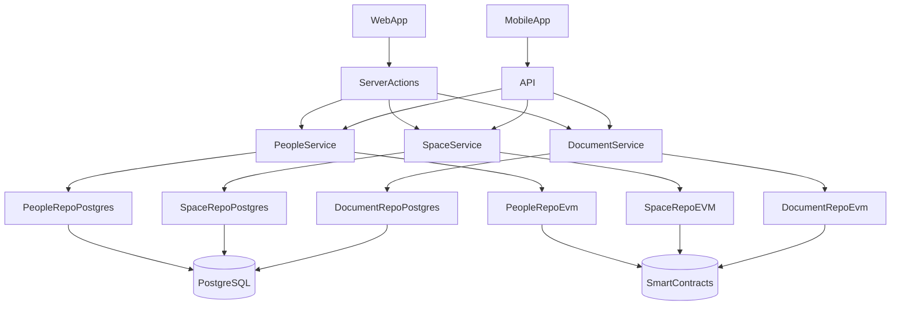

# @hypha-platform/core

Core package for Hypha platform that handles:

- Dependency injection
- Storage configuration
- Repository factory
- Context management

## Structure

```
src/
  ├── config/         # Configuration management
  ├── container/      # DI container
  ├── factory/        # Repository factories
  └── context/        # Context management
```

### Service Repository Pattern



## Usage

```typescript
import { Container, CoreConfig } from '@hypha-platform/core';

// Configure storage
const config: CoreConfig = {
  storage: {
    space: 'postgres',
    agreement: 'postgres',
    member: 'memory',
    comment: 'memory',
  },
};

// Use in your application
const container = createContainer(config);
const spaceRepo = container.get(Tokens.SpaceRepository);
```
