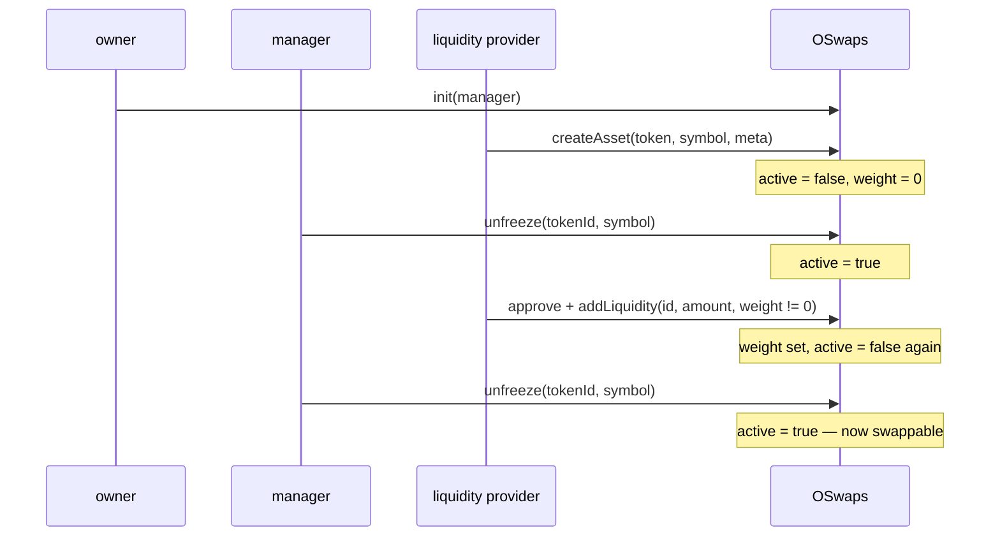

# OSwaps — Contract Reference

Complete functional reference for `contracts/seedsexample/OSwaps.sol`.

**Audience:** an engineer or AI agent implementing a UI against this contract. Everything needed to
build a working interface is here: the full external surface, the role model, the bootstrap
sequence, the pricing math (with a bit-exact TypeScript port for off-chain quoting), the revert
catalogue, and the behavioural traps that will otherwise cost you a day of debugging.

> **Status: not deployed.** OSwaps is a reference port of the Antelope/EOSIO `oswaps` contract. It
> has no entry in `contracts/addresses.txt`, no deploy script, no tests, and is excluded from
> `wagmi.config.ts` so it does not appear in `packages/core/src/generated.ts`. Any UI work must
> begin by deploying it to a local or test network. Read the "Known defects" section before
> building anything — several items change what the UI must do.
>
> For how faithfully this reproduces the original protocol, see
> [`OSwaps.EOSIO-PARITY.md`](./OSwaps.EOSIO-PARITY.md).

---

## 1. What the contract does

OSwaps is a multi-token liquidity pool. A single contract instance holds balances of many ERC-20
tokens and prices swaps between any two of them using the Balancer constant-value invariant:

```
V = B1^W1 * B2^W2 * ... * Bn^Wn
```

where `Bi` is the pool's balance of token `i` and `Wi` is that token's weight. `V` is held constant
across a swap, which determines the output amount.

In the small-trade limit (negligible slippage, and there are no fees at all here), swapping `Qi` of
token `i` yields:

```
Qj = Qi * (Bj / Bi) * (Wi / Wj)
```

Two properties distinguish this from Uniswap-style pools and drive most of the UI design:

**Liquidity is single-sided.** You deposit one token, not a pair. To keep the price of that token
unchanged, the contract raises its weight in proportion to the balance increase, so the ratio
`B/W` — which is what sets the price — stays fixed. That is what `weight = 0` means in
`addLiquidity` and `withdraw`: "recompute the weight for me so the price does not move."

**Weights are only meaningful as ratios.** The pricing math uses `wIn / wOut` and nothing else, so
the absolute scale is arbitrary and no normalisation is enforced or required. Weights do not sum to

1. `1e18` is a convenient unit but the contract does not care.

---

## 2. Roles and authorisation

| Role      | How it is set                        | Powers                                                                  |
| --------- | ------------------------------------ | ----------------------------------------------------------------------- |
| `owner`   | Deployer, via OpenZeppelin `Ownable` | `init`, `emergencyWithdraw`                                             |
| `manager` | Set once by `owner` via `init`       | `freeze`, `unfreeze`, `forgetAsset`, `withdraw`                         |
| anyone    | —                                    | `createAsset`, `addLiquidity`, `swapExactIn`, `swapExactOut`, all views |

Two things to internalise before designing screens:

**Liquidity providers cannot withdraw their own liquidity.** `withdraw` is `onlyManager`. An LP
deposits permissionlessly and receives LIQ receipt tokens, but exit is entirely at the manager's
discretion. This is faithful to the original design, not an oversight. Do not build a "remove
liquidity" button for ordinary users — build a manager console.

**`emergencyWithdraw` lets the owner move any token out of the pool at any time.** It is
unrestricted and permanent. Any UI that surfaces pool balances to depositors should disclose this.

`manager` is `address(0)` until `init` is called, so all manager functions revert before
initialisation. `init` can only be called once and there is no way to rotate the manager
afterwards — if the manager key is lost, freeze/unfreeze/withdraw/forgetAsset are permanently
unavailable.

---

## 3. State model

```solidity
struct Config {
  address manager;      // set once via init()
  bytes32 chainId;      // vestigial, never read (see Known defects #7)
  uint64  lastTokenId;  // monotonically increasing; last id issued by createAsset
}

struct AssetInfo {
  uint64  tokenId;
  address contractAddress; // the ERC-20
  string  symbol;          // free-form label, NOT read from the token
  bool    active;          // false = swaps and deposits blocked
  string  metadata;        // free-form, intended for JSON
  uint256 weight;          // Balancer weight; only the ratio to other weights matters
}
```

| Storage           | Type                           | Notes                                                 |
| ----------------- | ------------------------------ | ----------------------------------------------------- |
| `config`          | `Config`                       | public getter returns 3 flat values                   |
| `assets`          | `mapping(uint64 => AssetInfo)` | public getter returns 6 flat values, **not** a struct |
| `liquidityTokens` | `mapping(uint64 => address)`   | the `LiquidityToken` deployed for each asset          |
| `tokenIds`        | `uint64[]`                     | append-only, never pruned, **no length getter**       |

Pool balances are not stored. Every read and every price calculation calls
`IERC20(token).balanceOf(address(this))` live. This has a direct consequence: **any token
transferred to the contract address becomes pool liquidity with no LIQ issued against it.** A
donation silently improves the price for everyone and is unrecoverable by the sender.

### Enumerating assets

`tokenIds` is public but Solidity only generates an element getter, not a length getter, so you
cannot iterate it without knowing its size. Use one of these instead:

1. **Preferred:** read `config().lastTokenId` and loop `1..lastTokenId`, calling `assets(i)` and
   skipping entries whose `symbol` is empty (empty means never created, or deleted by
   `forgetAsset`). Ids are assigned sequentially from 1, so this is complete.
2. Index `AssetCreated` events. Note that `forgetAsset` emits nothing, so an event-only index will
   show deleted assets as live. Cross-check against `assets(i)`.

---

## 4. Lifecycle — the bootstrap sequence

This is the single most important section for a UI implementer. A newly created asset is **inactive
with zero weight**, and the obvious call order does not work. The required sequence is:



Why each step is necessary:

- `createAsset` always sets `active = false` and `weight = 0`.
- `addLiquidity` requires `active || amount == 0`, so a deposit into a fresh asset reverts with
  `Token is frozen`. The manager must `unfreeze` first.
- The **first** deposit must pass a non-zero `weight`. Passing `weight = 0` on an empty pool leaves
  the weight at zero (see Known defects #1), and a zero weight makes every swap _out of_ that token
  revert with a division-by-zero panic.
- Passing a non-zero `weight` deliberately freezes the asset, because a non-zero weight means the
  price changed and the original protocol requires manager review before trading resumes. So a
  second `unfreeze` is needed.

Repeat `createAsset` → `unfreeze` → `addLiquidity` → `unfreeze` for each token. At least two assets
must be live before any swap is possible.

---

## 5. External function reference

### `init(address manager)`

`onlyOwner`. One-shot. Sets the manager. Reverts `Already initialized` if `config.manager` is
already non-zero. There is no manager rotation, and passing `address(0)` is not rejected but would
permanently brick all manager functions.

### `createAsset(address tokenContract, string symbol, string metadata) → uint64 tokenId`

Permissionless. Increments `config.lastTokenId`, registers the asset with `active = false` and
`weight = 0`, appends to `tokenIds`, and deploys a fresh `LiquidityToken` (see §7) whose name and
symbol are both `"LIQ" + tokenId` (e.g. `LIQ1`).

Reverts only on `tokenContract == address(this)` (`Cannot be oswaps`). Notably it does **not**
verify that `tokenContract` is a contract or an ERC-20, does not check for duplicate registration
of the same token, and does not read the token's real symbol or decimals — the `symbol` argument is
a free-form label used solely for the confirmation check in `freeze`/`unfreeze`.

Because it is permissionless and deploys a contract per call, it is a gas-griefing surface: anyone
can register unlimited junk assets and inflate `lastTokenId`, which lengthens the enumeration loop
in §3. A UI should treat unfamiliar assets as untrusted and maintain an allowlist.

Emits `AssetCreated(tokenId, tokenContract, symbol)`.

### `forgetAsset(uint64 tokenId)`

`onlyManager`. Deletes `assets[tokenId]`. Reverts `Token not found` if the symbol is empty.

Incompletely implemented — it leaves `liquidityTokens[tokenId]` populated, leaves the id in
`tokenIds`, does not destroy or freeze the LIQ token, and does not check that the pool balance is
zero. **Any pool balance of a forgotten asset becomes permanently unreachable** except through
`emergencyWithdraw`, because every other path requires a live asset record. Emits no event, so
event-based indexers will not notice. A UI should confirm destructively and warn about the trapped
balance.

### `freeze(uint64 tokenId, string symbol)` / `unfreeze(uint64 tokenId, string symbol)`

`onlyManager`. Sets `active` false/true. The `symbol` argument must equal the stored symbol exactly
(compared by `keccak256`) — it is a typo guard, mirroring the original protocol. Reverts
`Token not found` or `Symbol mismatch`. Both emit `AssetFrozen(tokenId, frozen)`.

### `queryPool(uint64[] tokenIdList) → PoolStatus[]`

View. Returns `{ tokenId, balance, weight }` per requested id, with `balance` read live from the
token. **Reverts `Token not found` if any single id in the list is unregistered or forgotten**, so
never pass unvalidated ids — one bad entry fails the whole batch. Filter first using the
enumeration in §3.

This is the primary read for a UI. It gives you everything needed to compute prices client-side.

### `addLiquidity(uint64 tokenId, uint256 amount, uint256 weight)`

Permissionless, `nonReentrant`. Requires prior `approve` of `amount` to the OSwaps address.

1. Requires the asset to exist and `active || amount == 0`.
2. Pulls `amount` via `transferFrom`.
3. Sets the weight: if `weight != 0` it is used verbatim; if `weight == 0` **and** the pre-deposit
   balance was non-zero, the weight is scaled to preserve price as
   `w_new = w_old * (balBefore + amount) / balBefore`.
4. If `weight != 0`, sets `active = false`.
5. If `amount > 0`, mints `amount` LIQ 1:1 to the caller and emits
   `LiquidityAdded(caller, tokenId, amount, amount)`.

Two supported modes worth exposing separately in a UI:

- **Deposit at current price** — `weight = 0`, `amount > 0`, existing balance non-zero. Price
  unchanged, asset stays tradeable, no manager action needed.
- **Reprice without depositing** — `amount = 0`, `weight != 0`. Allowed even while frozen, since
  the `active || amount == 0` check passes. This is how a manager adjusts a price. It freezes the
  asset and emits **no event at all** (the `LiquidityAdded` emit is inside `if (amount > 0)`), so
  weight changes are invisible to indexers. Poll `assets(id).weight` instead.

### `withdraw(address account, uint64 tokenId, uint256 amount, uint256 weight)`

`onlyManager`, `nonReentrant`. The mirror of `addLiquidity`.

Requires `balBefore > amount` — strictly greater, so the pool can never be fully drained through
this path. Weight handling mirrors deposit: `weight == 0` scales to
`w_new = w_old * (balBefore - amount) / balBefore` to hold price; non-zero sets it verbatim and
freezes the asset. Burns `amount` LIQ from `account` — **without allowance**, since the pool owns
the LIQ token — then transfers `amount` of the underlying to `account`.

The LIQ burn reverts if `account` holds less than `amount`, which is the only thing tying a
withdrawal to an actual deposit. Because LIQ is freely transferable (Known defects #4), the manager
must verify `account` still holds its receipts before calling.

Emits `LiquidityWithdrawn(account, tokenId, amount, amount)`.

### `swapExactIn(address recipient, uint64 inTokenId, uint64 outTokenId, uint256 inAmount) → uint256 outAmount`

Permissionless, `nonReentrant`. Requires prior `approve` of `inAmount`.

Both assets must exist and be `active`. Reads both balances, requires `inBalBefore > 0`, pulls
`inAmount`, computes the output via the Balancer formula (§6), requires
`0 < outAmount < outBalBefore`, transfers the output to `recipient`, emits `TokenSwapped`.

> **There is no minimum-output parameter.** The caller has no on-chain slippage protection and the
> transaction is fully sandwichable in a public mempool. Any UI must compute an expected output,
> show the user a tolerance, and — since the contract cannot enforce it — wrap the call in a router
> or multicall that checks the received amount and reverts, or accept the exposure explicitly.
> `swapExactOut` does have a `maxInAmount` guard; this asymmetry is real, not a documentation error.

`inTokenId == outTokenId` is not rejected. It will either revert on the output-amount check or
return a self-swap at a loss. Block it in the UI.

### `swapExactOut(address recipient, uint64 inTokenId, uint64 outTokenId, uint256 outAmount, uint256 maxInAmount) → uint256 inAmount`

Permissionless, `nonReentrant`. Requires prior `approve` of at least `maxInAmount`.

Same validation, plus `outBalBefore > outAmount` (`Insufficient output balance`). Computes the
required input, reverts `Excessive input amount` if it exceeds `maxInAmount`, then pulls exactly
`inAmount` and sends `outAmount`. Because the exact amount is pulled, no refund path is needed.

### `emergencyWithdraw(address token, uint256 amount)`

`onlyOwner`. Transfers any amount of any token to the owner. No timelock, no event, no restriction
to registered assets. This is the contract's largest trust assumption.

---

## 6. Pricing math and off-chain quoting

### The formulas

`swapExactIn` solves for the output balance:

```
outBalAfter = outBalBefore * (inBalAfter / inBalBefore) ^ (-wIn / wOut)
outAmount   = outBalBefore - outBalAfter
```

`swapExactOut` solves for the input balance:

```
inBalAfter = inBalBefore * (outBalAfter / outBalBefore) ^ (-wOut / wIn)
inAmount   = inBalAfter - inBalBefore
```

Both are evaluated as `exp(exponent * ln(ratio))` using **hand-rolled Taylor series** in
18-decimal fixed point: a 10-term series for `ln` and a 20-term series for `exp`. This is the
critical implementation detail, because those series have a limited domain of convergence.

### Accuracy envelope — measured

`_ln` is a Taylor expansion about `x = 1`, which converges only for `0 < x < 2` and slowly near the
edges. Each swap direction feeds it a different ratio, so the two functions have **different
envelopes and opposite error directions.** Both matter.

**`swapExactIn`.** The ratio is `inBalAfter / inBalBefore = 1 + inAmount / inBalBefore`, so the
constraint is trade size as a fraction of the **input**-side balance. Errors here _underpay the
trader_, meaning the pool gains:

| `inAmount` vs input pool balance | Error     | Verdict     |
| -------------------------------- | --------- | ----------- |
| 1% – 30%                         | < 0.0001% | Accurate    |
| 40%                              | −0.0007%  | Accurate    |
| 50%                              | −0.0061%  | Acceptable  |
| 60%                              | −0.036%   | Degraded    |
| 75%                              | −0.30%    | Degraded    |
| 90%                              | −1.75%    | Badly wrong |
| 100%                             | −4.87%    | Badly wrong |
| 125%                             | −51%      | Badly wrong |
| ≥ 150%                           | —         | Reverts     |

**`swapExactOut`.** The ratio is `outBalAfter / outBalBefore = 1 − outAmount / outBalBefore`, so the
constraint is the requested output as a fraction of the **output**-side balance. Errors here run the
other way — they _undercharge the trader_, so the pool loses:

| `outAmount` vs output pool balance | Error in required input | Invariant `V` change | Verdict     |
| ---------------------------------- | ----------------------- | -------------------- | ----------- |
| 1% – 25%                           | < 0.0001%               | ~0                   | Accurate    |
| 33%                                | −0.0002%                | −0.00002%            | Accurate    |
| 40%                                | −0.0015%                | −0.0001%             | Accurate    |
| 50%                                | −0.017%                 | −0.008%              | Degraded    |
| 60%                                | −0.12%                  | −0.06%               | Degraded    |
| 75%                                | −1.67%                  | −1.26%               | Badly wrong |
| 90%                                | −18.7%                  | −16.8%               | Badly wrong |
| ≥ 100%                             | —                       | —                    | Reverts     |

The weight ratio constrains things independently, because the exponent is `-(wIn/wOut) * ln(ratio)`
and `_exp` also diverges for large arguments. At a 10% trade size, ratios up to `wIn/wOut ≈ 50` stay
accurate; `≈ 100` and above revert.

Three conclusions that should shape the UI directly:

**No standalone theft is possible, but `swapExactOut` leaks LP value.** Out-of-range inputs revert
rather than executing, because the diverging series makes a subtraction underflow, which Solidity 0.8
turns into a panic. And across 525 executable `swapExactOut` configurations — weight ratios from 0.02
to 50, pool imbalance from 1:100 to 100:1, output sizes from 1% to 99% — no combination lets a caller
buy the output for less than its pre-trade spot value, so there is no self-contained drain. What
`swapExactOut` _does_ do is break the invariant downward, by as much as 16.8% of `V` on a single
large trade. That value is real and is captured by whoever was going to arbitrage the pool anyway, at
the expense of liquidity providers.

**Cap `swapExactOut` harder than `swapExactIn`.** Its accurate range is narrower (roughly 40% of the
output balance versus 50% of the input balance) and its errors point against the pool rather than for
it. Treat 40% as the safe ceiling for exact-out and 50% for exact-in, warn up to 75%, and block
beyond that.

**Present the caps as liquidity limits.** "This pool does not have enough liquidity for that trade"
is accurate and reads naturally. Anchor the check on the correct side of the pool for each direction
— input balance for exact-in, output balance for exact-out — since confusing the two will let bad
trades through.

### Bit-exact TypeScript port for quoting

There is no `quote` view function on the contract, and simulating via `eth_call` requires the caller
to already hold the balance and allowance — awkward for a quote on a form the user has not funded
yet. Replicate the math instead. Truncation must match Solidity exactly, so use `BigInt` throughout
and never `Number`. JavaScript `BigInt` division truncates toward zero, matching Solidity `int256`
division, and unary minus binds tighter than division in both languages, so the expressions below
are faithful line for line.

```ts
const ONE = 10n ** 18n;

/** Mirrors OSwaps._ln — 10-term Taylor series about x = 1, 18-decimal fixed point. */
function ln(x: bigint): bigint {
  if (x <= 0n) throw new Error('ln: x must be positive');
  const diff = x - ONE;
  if (diff === 0n) return 0n;
  let result = diff;
  let term = diff;
  for (let i = 2n; i <= 10n; i++) {
    term = (term * diff) / ONE;
    if (i % 2n === 0n) result -= term / i;
    else result += term / i;
  }
  return result;
}

/** Mirrors OSwaps._exp — 20-term Taylor series, 18-decimal fixed point. */
function exp(x: bigint): bigint {
  let result = ONE;
  let term = ONE;
  for (let i = 1n; i <= 20n; i++) {
    term = (term * x) / (i * ONE);
    result += term;
    if (term === 0n) break;
  }
  return result;
}

/** Mirrors swapExactIn. Returns null where the contract would revert. */
export function quoteExactIn(inBalBefore: bigint, inAmount: bigint, outBalBefore: bigint, wIn: bigint, wOut: bigint): bigint | null {
  if (inBalBefore === 0n || wOut === 0n) return null;
  const ratio = ((inBalBefore + inAmount) * ONE) / inBalBefore;
  const exponent = -(wIn * ln(ratio)) / wOut;
  const outBalAfter = (outBalBefore * exp(exponent)) / ONE;
  if (outBalAfter > outBalBefore) return null; // would underflow and revert
  const outAmount = outBalBefore - outBalAfter;
  if (outAmount === 0n || outAmount >= outBalBefore) return null;
  return outAmount;
}

/** Mirrors swapExactOut. Returns null where the contract would revert. */
export function quoteExactOut(inBalBefore: bigint, outBalBefore: bigint, outAmount: bigint, wIn: bigint, wOut: bigint): bigint | null {
  if (inBalBefore === 0n || wIn === 0n || outBalBefore <= outAmount) return null;
  const ratio = ((outBalBefore - outAmount) * ONE) / outBalBefore;
  const exponent = -(wOut * ln(ratio)) / wIn;
  const inBalAfter = (inBalBefore * exp(exponent)) / ONE;
  if (inBalAfter < inBalBefore) return null;
  return inBalAfter - inBalBefore;
}
```

To also surface how much the approximation is costing the user, compute the exact value with
floating point and show the gap:

```ts
export function exactQuoteOut(inBalBefore: bigint, inAmount: bigint, outBalBefore: bigint, wIn: bigint, wOut: bigint): number {
  const ib = Number(inBalBefore),
    ob = Number(outBalBefore);
  return ob - ob * Math.pow((ib + Number(inAmount)) / ib, -(Number(wIn) / Number(wOut)));
}
```

A gap beyond a fraction of a percent means the trade is outside the reliable envelope.

---

## 7. The LIQ receipt token

`createAsset` deploys one `LiquidityToken` per asset — a minimal `ERC20 + Ownable` whose owner is
the OSwaps contract, exposing `mint(to, amount)` and `burnFrom(from, amount)`, both `onlyOwner`.
Note that `burnFrom` does **not** consult allowances despite the name; the pool burns unilaterally.

LIQ is minted 1:1 against the raw deposited amount and burned 1:1 against the raw withdrawn amount.
It therefore represents a **nominal claim on units deposited, not a proportional share of the
pool.** Two consequences:

- Total LIQ supply does not track the pool balance. Swaps, donations, and `emergencyWithdraw` all
  change the balance without changing LIQ supply. Never render LIQ as a percentage of the pool.
- **LIQ always has 18 decimals regardless of the underlying token.** Depositing 1 USDC (`1e6` raw)
  mints `1e6` base units of an 18-decimal token, which renders as `0.000000000001 LIQ`. Format LIQ
  balances using the _underlying token's_ decimals to get a number that means anything to a user,
  and never assume LIQ decimals match the asset. See Known defects #3.

---

## 8. Events

| Event                                                                                                                       | Emitted by                             | Indexed                    |
| --------------------------------------------------------------------------------------------------------------------------- | -------------------------------------- | -------------------------- |
| `AssetCreated(uint64 tokenId, address tokenContract, string symbol)`                                                        | `createAsset`                          | `tokenId`, `tokenContract` |
| `AssetFrozen(uint64 tokenId, bool frozen)`                                                                                  | `freeze`, `unfreeze`                   | `tokenId`                  |
| `LiquidityAdded(address account, uint64 tokenId, uint256 amount, uint256 liqTokensMinted)`                                  | `addLiquidity`, only when `amount > 0` | `account`, `tokenId`       |
| `LiquidityWithdrawn(address account, uint64 tokenId, uint256 amount, uint256 liqTokensBurned)`                              | `withdraw`                             | `account`, `tokenId`       |
| `TokenSwapped(address sender, address recipient, uint64 inTokenId, uint64 outTokenId, uint256 inAmount, uint256 outAmount)` | both swaps                             | `sender`, `recipient`      |

Gaps to plan around: `forgetAsset` and `emergencyWithdraw` emit nothing; weight changes emit
nothing; and `inTokenId`/`outTokenId` on `TokenSwapped` are **not** indexed, so per-pair filtering
must happen client-side after fetching by sender or recipient.

---

## 9. Revert catalogue

| Message                                            | Source                                                                       |
| -------------------------------------------------- | ---------------------------------------------------------------------------- |
| `Only manager`                                     | manager-gated function called by another address                             |
| `Already initialized`                              | second `init`                                                                |
| `Token not found`                                  | `freeze`, `unfreeze`, `forgetAsset`, `queryPool`, `addLiquidity`, `withdraw` |
| `Symbol mismatch`                                  | `freeze`/`unfreeze` symbol argument does not match stored                    |
| `Cannot be oswaps`                                 | `createAsset` with the pool's own address                                    |
| `Token is frozen`                                  | `addLiquidity` with `amount > 0` on an inactive asset                        |
| `Input token not found` / `Output token not found` | swaps with an unregistered id                                                |
| `Input token frozen` / `Output token frozen`       | swaps on an inactive asset                                                   |
| `Zero input balance`                               | swaps when the input side holds nothing                                      |
| `Insufficient output balance`                      | `swapExactOut` with `outAmount >= outBalBefore`                              |
| `Insufficient balance`                             | `withdraw` with `amount >= balBefore`                                        |
| `Invalid output amount`                            | computed output is 0 or ≥ pool balance — usually the math envelope           |
| `Excessive input amount`                           | `swapExactOut` computed input above `maxInAmount`                            |
| `Transfer failed`                                  | an ERC-20 returned `false`                                                   |
| `ln: x must be positive`                           | ratio underflowed to 0                                                       |
| `Ownable*`                                         | OpenZeppelin owner errors                                                    |
| Panic `0x11` (arithmetic overflow/underflow)       | diverging Taylor series — trade far outside the envelope                     |
| Panic `0x12` (division by zero)                    | swapping out of an asset whose weight is 0                                   |

Map the last three to human-readable guidance. Panic `0x11` in practice means "trade too large for
this pool"; `0x12` means "this asset was never priced."

---

## 10. Known defects a UI must work around

None of these are fixed in the contract as it stands.

The **pricing-math envelope in §6 is the most consequential constraint** and is not repeated here:
both swap directions misprice outside a limited trade-size range, with `swapExactOut` erring against
the pool. Implement those caps first. The items below are the remaining issues, ordered by how much
they affect UI work.

**1. `addLiquidity` can silently leave weight at zero.** With `weight = 0` on an empty pool, the
original EOSIO contract reverts (`"zero weight requires existing balance"`); this port instead
skips the branch and leaves the weight at 0. Every later swap _out of_ that asset then reverts with
a division-by-zero panic and the asset is unusable until a manager repriced it. **Mitigation:**
require a non-zero weight in the form whenever the current pool balance is zero, and flag any asset
with `weight == 0` as misconfigured.

**2. `swapExactIn` has no minimum-output parameter.** No on-chain slippage protection, fully
sandwichable. **Mitigation:** enforce tolerance client-side and prefer `swapExactOut` (which has
`maxInAmount`) wherever the flow allows a fixed output.

**3. LIQ decimals do not match the underlying.** Always 18. **Mitigation:** format with the
underlying token's decimals, as described in §7.

**4. LIQ is freely transferable.** The original restricted LIQ to transfers involving the contract
only, blocking peer-to-peer trade in receipts. This port uses a plain ERC-20. **Mitigation:** the
manager console must check current LIQ balances before `withdraw`, since the holder may not be the
depositor.

**5. `IOSwaps.assets` in `ISeedsEcosystem.sol` is ABI-incompatible.** The interface declares
`returns (AssetInfo memory)`, but a public mapping getter returns six flat values. Because
`AssetInfo` contains dynamic `string` members, the struct encoding carries an extra offset word — 11
words versus 10 — so decoding the real return through this interface throws. **Mitigation:** do not
use `IOSwaps` for `assets`; generate types from the compiled artifact at
`artifacts/contracts/seedsexample/OSwaps.sol/OSwaps.json`. The rest of `IOSwaps` is accurate, and
`config()` happens to be compatible because `Config` is entirely static.

**6. `forgetAsset` leaves state behind and traps balances.** See §5. **Mitigation:** warn
destructively; treat empty-symbol ids as deleted when enumerating.

**7. `config.chainId` is meaningless.** It is set once in the constructor to
`blockhash(block.number - 1)` — a block hash, not a chain identifier — and never read anywhere. In
the original it held the real Telos chain id to support future cross-chain asset identification.
**Mitigation:** ignore the field. Do not display it.

**8. No safety for non-standard ERC-20s.** Transfers use raw `require(token.transfer(...))` rather
than `SafeERC20`, so tokens that return no value on transfer will revert on ABI decoding. And
because all accounting is balance-based, **fee-on-transfer and rebasing tokens will mis-price
persistently.** **Mitigation:** allowlist assets; exclude fee-on-transfer and rebasing tokens.

**9. `createAsset` is unvalidated and permissionless.** No check that the target is a contract, no
duplicate detection, no verification of the `symbol` label against the token. Junk assets inflate
`lastTokenId`. **Mitigation:** maintain an allowlist; never trust the stored `symbol` — read the
real one from the token contract.

**10. `onlyActive` modifier is dead code.** Declared and never applied; the same check is inlined at
each call site. Harmless, but do not read its presence as evidence of a guard.

---

## 11. Minimum viable UI

A suggested scope, in dependency order.

**Read layer.** Enumerate assets (§3), then `queryPool` over the valid ids for balances and
weights. Resolve real symbol and decimals from each token contract, not from the stored label.
Derive the marginal price of `i` against `j` as `(Bj/Wj) / (Bi/Wi)`.

**Swap form.** Token in, token out, amount, direction (exact-in or exact-out). Quote with the
functions in §6. Enforce the per-direction trade-size caps from §6, checking against the input
balance for exact-in and the output balance for exact-out. Show output, effective price, slippage
against the marginal price, and the approximation gap. Two transactions: `approve`, then the swap.
Block `inTokenId == outTokenId` and any asset that is inactive or zero-weight.

**Liquidity form.** Deposit only, with the price-preserving path (`weight = 0`) as the default and a
non-zero weight required when the pool is empty. Make clear that withdrawal requires the manager,
and that LIQ is a nominal receipt rather than a pool share.

**Manager console.** Freeze/unfreeze (with the symbol confirmation), withdraw to an address, reprice
via `addLiquidity(id, 0, newWeight)`, and `forgetAsset` behind a destructive confirmation. Surface
which assets are frozen and why — an asset frozen by a reprice needs an explicit unfreeze before
trading resumes, and that is the state users will most often get stuck in.

---

## 12. Before building

Recommended prerequisites, in order:

1. Add a deploy script and a Hardhat test suite. The contract has neither, and no test has ever
   exercised the math.
2. Decide whether to keep the Taylor-series math. Replacing `_ln`/`_exp` with an audited
   fixed-point library (`PRBMath`, `solmate`'s `FixedPointMathLib`) removes the trade-size cap and
   the whole class of envelope reverts, at the cost of diverging further from a literal port. This
   is the highest-value change and it needs an explicit decision — see
   [`OSwaps.EOSIO-PARITY.md`](./OSwaps.EOSIO-PARITY.md) §6.
3. Add `quoteExactIn` / `quoteExactOut` view functions so the UI is not maintaining a parallel
   implementation of the pricing math.
4. Add `getTokenIds()` and a `minOutAmount` parameter on `swapExactIn`.
5. Add the contract to `wagmi.config.ts` so typed bindings land in
   `packages/core/src/generated.ts` and the UI is not hand-writing ABIs.
