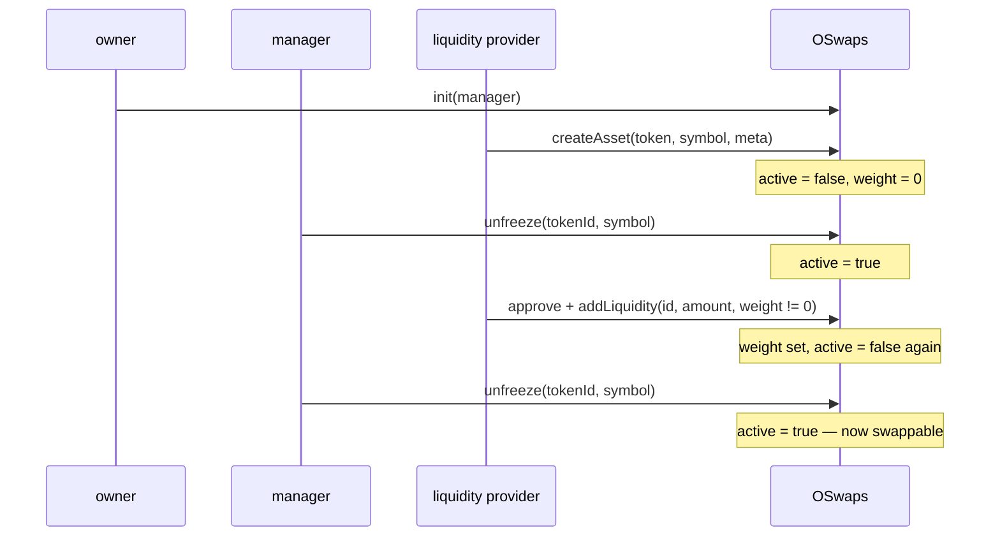

# OSwaps — Contract Reference

Complete functional reference for `contracts/seedsexample/OSwaps.sol`.

**Audience:** an engineer or AI agent implementing a UI against this contract. Everything needed to
build a working interface is here: the full external surface, the role model, the bootstrap
sequence, the pricing math and its measured accuracy, the revert catalogue, and the behavioural
traps that will otherwise cost you a day of debugging.

> **Status: not deployed.** OSwaps is a reference port of the Antelope/EOSIO `oswaps` contract. It
> has no entry in `contracts/addresses.txt` and is excluded from `wagmi.config.ts`, so it does not
> appear in `packages/core/src/generated.ts`. It does now have a deploy script
> (`scripts/oswaps.deploy.ts`) and a test suite (`test/OSwaps.test.ts`, 85 cases). Any UI work must
> begin by deploying it to a local or test network.
>
> For how faithfully this reproduces the original protocol, see
> [`OSwaps.EOSIO-PARITY.md`](./OSwaps.EOSIO-PARITY.md).

---

## 1. What the contract does

OSwaps is a multi-token liquidity pool. A single contract instance holds balances of many ERC-20
tokens and prices swaps between any two of them using the Balancer constant-value invariant:

```
V = B1^W1 * B2^W2 * ... * Bn^Wn
```

where `Bi` is the pool's balance of token `i` and `Wi` is that token's weight. `V` is held constant
across a swap, which determines the output amount.

In the small-trade limit (negligible slippage, and there are no fees at all here), swapping `Qi` of
token `i` yields:

```
Qj = Qi * (Bj / Bi) * (Wi / Wj)
```

Two properties distinguish this from Uniswap-style pools and drive most of the UI design.

**Liquidity is single-sided.** You deposit one token, not a pair. To keep the price of that token
unchanged, the contract raises its weight in proportion to the balance increase, so the ratio
`B/W` — which is what sets the price — stays fixed. That is what `weight = 0` means in
`addLiquidity` and `withdraw`: "recompute the weight for me so the price does not move."

**Weights are only meaningful as ratios.** The pricing math uses `wIn / wOut` and nothing else, so
the absolute scale is arbitrary and no normalisation is enforced or required. Weights do not sum to

1. `1e18` is a convenient unit but the contract does not care.

---

## 2. Roles and authorisation

| Role      | How it is set                        | Powers                                                                  |
| --------- | ------------------------------------ | ----------------------------------------------------------------------- |
| `owner`   | Deployer, via OpenZeppelin `Ownable` | `init` only, and only once                                              |
| `manager` | `init`, then rotated by `setManager` | `freeze`, `unfreeze`, `forgetAsset`, `withdraw`, `setManager`           |
| anyone    | —                                    | `createAsset`, `addLiquidity`, `swapExactIn`, `swapExactOut`, all views |

**The owner cannot move funds.** There is no owner-level withdrawal path. Once `init` has run, the
owner has no remaining powers at all, which matches the original protocol's design intent that the
owner key is cold and has no operational role.

**Liquidity providers cannot withdraw their own liquidity.** `withdraw` is `onlyManager`. An LP
deposits permissionlessly and receives LIQ receipt tokens, but exit is entirely at the manager's
discretion. This is faithful to the original design, not an oversight. Do not build a "remove
liquidity" button for ordinary users — build a manager console.

`manager` is `address(0)` until `init` is called, so every manager function reverts before
initialisation. `init` rejects the zero address and can only be called once; after that the
incumbent manager hands over via `setManager`, so the role is recoverable through governance but not
through the owner.

---

## 3. State model

```solidity
struct Config {
  address manager;      // set by init, rotated by setManager
  bytes32 chainId;      // block.chainid at deployment; informational, never read
  uint64  lastTokenId;  // monotonically increasing; last id issued by createAsset
}

struct AssetInfo {
  uint64  tokenId;
  address contractAddress; // the ERC-20; address(0) means "no such asset"
  string  symbol;          // free-form label, NOT read from the token
  bool    active;          // false = swaps and deposits blocked
  string  metadata;        // free-form, intended for JSON
  uint256 weight;          // Balancer weight; only the ratio to other weights matters
}
```

| Storage            | Type                           | Read it via                                     |
| ------------------ | ------------------------------ | ----------------------------------------------- |
| `config`           | `Config`                       | `config()` — returns 3 flat values              |
| `assets`           | `mapping(uint64 => AssetInfo)` | **`getAsset(id)`**, not the `assets` getter     |
| `liquidityTokens`  | `mapping(uint64 => address)`   | `liquidityTokens(id)`                           |
| `tokenIdByAddress` | `mapping(address => uint64)`   | `tokenIdByAddress(token)`; 0 means unregistered |
| `_tokenIds`        | `uint64[]` (private)           | `getTokenIds()`, `getAssetCount()`              |

Use `getAsset(id)` rather than the auto-generated `assets(id)` getter. A public mapping getter
returns the struct members as separate values, whereas `getAsset` returns a real struct — and
because `AssetInfo` contains dynamic `string` members those two encodings differ, so a client typed
against one cannot decode the other. `getAsset` is what `IOSwaps` in `ISeedsEcosystem.sol` declares.

**Pool balances are not stored.** Every read and every price calculation calls
`IERC20(token).balanceOf(address(this))` live. This has a direct consequence: **any token
transferred to the contract address becomes pool liquidity with no LIQ issued against it.** A
donation silently improves the price for everyone and is unrecoverable by the sender.

### Enumerating assets

Call `getTokenIds()`. It returns exactly the live ids — `forgetAsset` prunes the array — so there is
no filtering to do and no need to walk `1..lastTokenId`. `getAssetCount()` gives the length if you
only need a count. Ids are never reused: `lastTokenId` only increases, even across `forgetAsset`.

---

## 4. Lifecycle — the bootstrap sequence

This is the single most important section for a UI implementer. A newly created asset is **inactive
with zero weight**, and the obvious call order does not work. The required sequence is:



Why each step is necessary:

- `createAsset` always sets `active = false` and `weight = 0`.
- `addLiquidity` requires `active || amount == 0`, so a deposit into a fresh asset reverts with
  `Token is frozen`. The manager must `unfreeze` first.
- The **first** deposit must pass a non-zero `weight`. Passing `weight = 0` while the pool balance
  is zero reverts with `Zero weight requires existing balance`, because there is no existing price
  to preserve.
- Passing a non-zero `weight` deliberately freezes the asset, because a non-zero weight means the
  price changed and the original protocol requires manager review before trading resumes. So a
  second `unfreeze` is needed.

Repeat `createAsset` → `unfreeze` → `addLiquidity` → `unfreeze` for each token. At least two assets
must be live before any swap is possible.

Retiring an asset is the mirror image: `freeze` → `withdraw` the full balance → `forgetAsset`. A
live asset cannot be emptied (its price would be undefined), so the freeze comes first.

---

## 5. External function reference

### `init(address manager)`

`onlyOwner`, one-shot. Sets the manager. Reverts `Already initialized` on a second call and
`Zero manager` on `address(0)`. Emits `ManagerUpdated(address(0), manager)`.

### `setManager(address newManager)`

`onlyManager`. Hands the manager role to another address. Reverts `Zero manager` on `address(0)`.
The owner cannot call this — only the incumbent manager can. Emits
`ManagerUpdated(previous, newManager)`.

### `createAsset(address tokenContract, string symbol, string metadata) → uint64 tokenId`

Permissionless. Increments `config.lastTokenId`, registers the asset with `active = false` and
`weight = 0`, appends to the id list, and deploys a fresh `LiquidityToken` (see §7) whose name and
symbol are both `"LIQ" + tokenId` (e.g. `LIQ1`) and whose decimals match the underlying token.

Reverts on the pool's own address (`Cannot be oswaps`), `address(0)` (`Zero token address`), an
address with no code (`Token is not a contract`), and a token that is already registered
(`Token already registered`).

It does **not** verify that the target is a real ERC-20 and does not read the token's actual symbol:
the `symbol` argument is a free-form label used only for the confirmation check in
`freeze`/`unfreeze`. Because it is permissionless and deploys a contract per call, it remains a
gas-griefing surface — anyone can register unlimited junk assets. A UI should treat unfamiliar
assets as untrusted, maintain an allowlist, and read the real symbol and decimals from the token
contract rather than from the stored label.

Emits `AssetCreated(tokenId, tokenContract, symbol)`.

### `forgetAsset(uint64 tokenId)`

`onlyManager`. Removes the asset completely: prunes the id list, and clears `assets`,
`liquidityTokens`, and `tokenIdByAddress`. The id is never reissued, and the token may be
re-registered afterwards under a new id.

**Requires the pool balance to be exactly zero** (`Pool balance not zero`), so no balance can be
stranded. Reaching zero requires freezing the asset first, since a live asset cannot be fully
drained. Emits `AssetForgotten(tokenId, tokenContract)`.

Note that the LIQ token contract itself is not destroyed — it remains on chain, but the pool loses
its reference and nothing can mint or burn it again. Any LIQ still outstanding when the asset is
forgotten becomes a dead balance, so drain to the receipt holders before retiring an asset.

### `freeze(uint64 tokenId, string symbol)` / `unfreeze(uint64 tokenId, string symbol)`

`onlyManager`. Sets `active` false/true. The `symbol` argument must equal the stored symbol exactly
(compared by `keccak256`) — it is a typo guard, mirroring the original protocol. Reverts
`Token not found` or `Symbol mismatch`. Both emit `AssetFrozen(tokenId, frozen)`.

### `queryPool(uint64[] tokenIdList) → PoolStatus[]`

View. Returns `{ tokenId, balance, weight }` per requested id, with `balance` read live from the
token. **Reverts `Token not found` if any single id in the list is unregistered**, so one bad entry
fails the whole batch — pass ids from `getTokenIds()`.

This is the primary read for a UI dashboard.

### `getTokenIds() → uint64[]` / `getAssetCount() → uint256` / `getAsset(uint64) → AssetInfo`

Views. See §3.

### `quoteExactIn(uint64 inTokenId, uint64 outTokenId, uint256 inAmount) → uint256 outAmount`

### `quoteExactOut(uint64 inTokenId, uint64 outTokenId, uint256 outAmount) → uint256 inAmount`

Views. Price a swap without executing it. They apply exactly the same validation and exactly the
same math as the swap functions, so a successful quote means the swap will succeed at that price in
the same block, and a failing quote reverts with the same message the swap would. Neither requires
the caller to hold a balance or an allowance, so they are safe to call against an unfunded form.

Use these rather than reimplementing the math off-chain.

### `addLiquidity(uint64 tokenId, uint256 amount, uint256 weight)`

Permissionless, `nonReentrant`. Requires prior `approve` of `amount` to the OSwaps address.

1. Requires the asset to exist and `active || amount == 0`.
2. Pulls `amount` via `safeTransferFrom`, then checks the balance rose by exactly `amount`.
3. Sets the weight: if `weight != 0` it is used verbatim; if `weight == 0` the pre-deposit balance
   must be non-zero and the weight is scaled to preserve price as
   `w_new = w_old * (balBefore + amount) / balBefore`.
4. If `weight != 0`, sets `active = false`.
5. Emits `WeightUpdated`, then — if `amount > 0` — mints `amount` LIQ 1:1 to the caller and emits
   `LiquidityAdded`.

Two supported modes worth exposing separately in a UI:

- **Deposit at current price** — `weight = 0`, `amount > 0`, existing balance non-zero. Price
  unchanged, asset stays tradeable, no manager action needed. This is the normal path.
- **Reprice without depositing** — `amount = 0`, `weight != 0`. Allowed even while frozen, since
  the `active || amount == 0` check passes. This is how a manager adjusts a price. It freezes the
  asset.

### `withdraw(address account, uint64 tokenId, uint256 amount, uint256 weight)`

`onlyManager`, `nonReentrant`. The mirror of `addLiquidity`.

While the asset is **active**, requires `balBefore > amount` — strictly greater, so a tradeable
asset can never be emptied. While it is **frozen**, `balBefore >= amount` is allowed, which is what
makes the freeze-drain-forget retirement path possible.

Weight handling mirrors deposit: `weight == 0` scales to
`w_new = w_old * (balBefore - amount) / balBefore` to hold price; non-zero sets it verbatim and
freezes the asset. Burns `amount` LIQ from `account` — **without allowance**, since the pool owns
the LIQ token — then transfers `amount` of the underlying to `account`.

The LIQ burn reverts (`ERC20InsufficientBalance`) if `account` holds less than `amount`, which is
the only thing tying a withdrawal to an actual deposit. Since LIQ cannot be traded peer-to-peer, the
holder is always the original depositor.

Emits `WeightUpdated` and `LiquidityWithdrawn`.

### `swapExactIn(address recipient, uint64 inTokenId, uint64 outTokenId, uint256 inAmount, uint256 minOutAmount) → uint256 outAmount`

Permissionless, `nonReentrant`. Requires prior `approve` of `inAmount`.

Validates both sides (§9), computes the output via the Balancer formula (§6), requires
`0 < outAmount < outBalBefore` and `outAmount >= minOutAmount`, pulls `inAmount`, checks the balance
rose by exactly that, transfers the output to `recipient`, and emits `TokenSwapped`.

`minOutAmount` is the caller's slippage floor. Pass a real value: `0` disables the protection and
leaves the transaction sandwichable in a public mempool. The usual pattern is
`quoteExactIn(...) * (1 - tolerance)`.

### `swapExactOut(address recipient, uint64 inTokenId, uint64 outTokenId, uint256 outAmount, uint256 maxInAmount) → uint256 inAmount`

Permissionless, `nonReentrant`. Requires prior `approve` of at least `maxInAmount`.

Same validation, plus `outBalBefore > outAmount` (`Insufficient output balance`). Computes the
required input, reverts `Excessive input amount` if it exceeds `maxInAmount`, then pulls exactly
`inAmount` and sends `outAmount`. Because the exact amount is pulled, no refund path is needed.

---

## 6. Pricing math

### The formulas

`swapExactIn` solves for the output balance; `swapExactOut` solves for the input balance:

```
outBalAfter = outBalBefore * (inBalAfter  / inBalBefore)  ^ (-wIn / wOut)
inBalAfter  = inBalBefore  * (outBalAfter / outBalBefore) ^ (-wOut / wIn)
```

Both are evaluated with **PRBMath's `UD60x18.pow`** in 18-decimal fixed point. Each is algebraically
rearranged so the base is always greater than one and the exponent is always positive, which keeps
every intermediate value unsigned:

```
outBalAfter = outBalBefore / (inBalAfter / inBalBefore) ^ ( wIn / wOut)
inBalAfter  = inBalBefore  * (outBalBefore / outBalAfter) ^ (wOut / wIn)
```

Truncation is biased so the leftover wei stays in the pool: the retained output balance rounds up,
and the charged input rounds up.

### Accuracy — measured

Measured against double-precision reference arithmetic. Relative error on the quoted amount:

| Conditions                                                             | Relative error |
| ---------------------------------------------------------------------- | -------------- |
| Equal weights, trades from 1e-5× to 10× the pool balance               | < 1e-11        |
| Weight ratios up to 100:1, trades from 0.1% to 50% of the pool balance | < 1e-10        |
| Weight ratios up to 50:1 including dust-sized trades                   | < 1e-9         |

The bound is loosest for very small trades, where the ratio handed to `pow` sits closest to 1 and
relative precision is worst — but the absolute amounts there are correspondingly tiny.

The residual error has **no guaranteed sign**, so a single swap can in principle move the invariant
`V` either way. The measured worst-case drop is below **1e-12 of pool value per swap**, which is
enforced by a test. Extracting anything meaningful would take on the order of 1e10 swaps, costing
vastly more in gas than it could yield.

### Domain limit

`pow` requires `log2(base) * exponent < 192`. In practice:

- **At or near equal weights there is effectively no trade-size ceiling.** Trades of 1×, 10×, and
  100× the pool balance all price correctly. (A very large input buys almost the whole output side
  but never all of it, so the pool cannot be emptied by a swap.)
- **Extreme weight ratios cap the trade size.** At `wIn/wOut = 50` the ceiling sits above 13× the
  input balance; a 20× trade reverts. At `wIn/wOut = 192` and above, even a doubling of the input
  balance is out of range.

Both limits are far outside anything a real pool would see, but surface the revert as "trade too
large for this pool" rather than as a raw PRBMath error.

### Off-chain price display

Use `quoteExactIn` / `quoteExactOut` for the actual numbers. Compute these client-side only for
display:

```ts
/** Marginal (spot) price of `out` denominated in `in`. */
export function spotPrice(inBal: bigint, wIn: bigint, outBal: bigint, wOut: bigint): number {
  return Number(inBal) / Number(wIn) / (Number(outBal) / Number(wOut));
}

/** Price impact of a quote, as a fraction: 0.01 means the trade paid 1% over spot. */
export function priceImpact(inAmount: bigint, outAmount: bigint, spot: number): number {
  const effective = Number(inAmount) / Number(outAmount);
  return effective / spot - 1;
}
```

Both are for presentation, so `Number` is fine. Never use `Number` to derive an amount you then
send on chain.

---

## 7. The LIQ receipt token

`createAsset` deploys one `LiquidityToken` per asset — a minimal `ERC20 + Ownable` whose owner is
the OSwaps contract, exposing `mint(to, amount)` and `burnFrom(from, amount)`, both `onlyOwner`.
Note that `burnFrom` does **not** consult allowances despite the name; the pool burns unilaterally.

Three properties to design around:

**Decimals match the underlying token.** Deposit 1 USDC and your LIQ1 balance reads as 1.0 at 6
decimals. For a token that does not expose `decimals()`, or reports something nonsensical, LIQ falls
back to 18.

**LIQ is a nominal claim on units deposited, not a proportional share of the pool.** It is minted
1:1 against the raw deposited amount and burned 1:1 against the raw withdrawn amount. Total supply
does not track the pool balance, because swaps and donations change the balance without changing
supply. Never render LIQ as a percentage of the pool.

**Peer-to-peer transfers are blocked.** Every transfer must involve the pool address; account-to-
account moves revert with `LIQ: transfers must involve pool`. This mirrors the original protocol and
means the receipt holder is always the original depositor. Do not build a transfer UI for LIQ.

---

## 8. Events

| Event                                                                                                                       | Emitted by                             | Indexed                            |
| --------------------------------------------------------------------------------------------------------------------------- | -------------------------------------- | ---------------------------------- |
| `ManagerUpdated(address previousManager, address newManager)`                                                               | `init`, `setManager`                   | both                               |
| `AssetCreated(uint64 tokenId, address tokenContract, string symbol)`                                                        | `createAsset`                          | `tokenId`, `tokenContract`         |
| `AssetForgotten(uint64 tokenId, address tokenContract)`                                                                     | `forgetAsset`                          | `tokenId`, `tokenContract`         |
| `AssetFrozen(uint64 tokenId, bool frozen)`                                                                                  | `freeze`, `unfreeze`                   | `tokenId`                          |
| `WeightUpdated(uint64 tokenId, uint256 previousWeight, uint256 newWeight, bool priceChanged)`                               | `addLiquidity`, `withdraw`             | `tokenId`                          |
| `LiquidityAdded(address account, uint64 tokenId, uint256 amount, uint256 liqTokensMinted)`                                  | `addLiquidity`, only when `amount > 0` | `account`, `tokenId`               |
| `LiquidityWithdrawn(address account, uint64 tokenId, uint256 amount, uint256 liqTokensBurned)`                              | `withdraw`                             | `account`, `tokenId`               |
| `TokenSwapped(address sender, address recipient, uint64 inTokenId, uint64 outTokenId, uint256 inAmount, uint256 outAmount)` | both swaps                             | `sender`, `recipient`, `inTokenId` |

Every state change emits something, so an event-only indexer can stay consistent. Two things to note:
`WeightUpdated` fires on every `addLiquidity` and `withdraw`, including price-holding ones (read
`priceChanged` to distinguish a deliberate reprice from an automatic rescale); and only `inTokenId`
is indexed on `TokenSwapped`, so filtering by output token must happen client-side.

---

## 9. Revert catalogue

| Message                                            | Source                                                                       |
| -------------------------------------------------- | ---------------------------------------------------------------------------- |
| `Only manager`                                     | manager-gated function called by another address, including by the owner     |
| `Already initialized`                              | second `init`                                                                |
| `Zero manager`                                     | `init` or `setManager` with `address(0)`                                     |
| `Token not found`                                  | `freeze`, `unfreeze`, `forgetAsset`, `queryPool`, `addLiquidity`, `withdraw` |
| `Symbol mismatch`                                  | `freeze`/`unfreeze` symbol argument does not match stored                    |
| `Cannot be oswaps`                                 | `createAsset` with the pool's own address                                    |
| `Zero token address`                               | `createAsset` with `address(0)`                                              |
| `Token is not a contract`                          | `createAsset` with an address that has no code                               |
| `Token already registered`                         | `createAsset` with a token that already has an id                            |
| `Pool balance not zero`                            | `forgetAsset` before the asset has been drained                              |
| `Token is frozen`                                  | `addLiquidity` with `amount > 0` on an inactive asset                        |
| `Zero weight requires existing balance`            | `addLiquidity` with `weight = 0` while the pool balance is zero              |
| `Unexpected balance change`                        | fee-on-transfer or rebasing token detected mid-transfer                      |
| `Zero amount`                                      | `withdraw` or a swap with a zero amount                                      |
| `Zero recipient`                                   | swap to `address(0)`                                                         |
| `Same token`                                       | swap or quote with `inTokenId == outTokenId`                                 |
| `Input token not found` / `Output token not found` | swaps or quotes with an unregistered id                                      |
| `Input token frozen` / `Output token frozen`       | swaps or quotes on an inactive asset                                         |
| `Input weight not set` / `Output weight not set`   | the asset was never priced                                                   |
| `Zero input balance` / `Zero output balance`       | the pool holds nothing on that side                                          |
| `Insufficient output balance`                      | `swapExactOut` with `outAmount >= outBalBefore`                              |
| `Insufficient balance`                             | `withdraw` beyond what the asset holds                                       |
| `Invalid output amount` / `Invalid input amount`   | the computed amount is 0, or the output is ≥ the pool balance                |
| `Insufficient output amount`                       | `swapExactIn` output below `minOutAmount`                                    |
| `Excessive input amount`                           | `swapExactOut` computed input above `maxInAmount`                            |
| `LIQ: transfers must involve pool`                 | attempted peer-to-peer LIQ transfer                                          |
| `ERC20InsufficientBalance` (custom)                | `withdraw` when `account` holds too little LIQ                               |
| `ERC20InsufficientAllowance` (custom)              | caller has not approved the pool                                             |
| `OwnableUnauthorizedAccount` (custom)              | non-owner called `init`                                                      |
| `PRBMath_UD60x18_Exp2_InputTooBig` (custom)        | trade beyond the exponent domain — see §6                                    |

---

## 10. Constraints a UI must handle

The math envelope is no longer one of them: both directions are accurate across any realistic trade
size, and there is no trade-size cap to enforce. What remains:

**1. Withdrawal is manager-gated.** LPs deposit permissionlessly and cannot exit on their own.
Surface this prominently before anyone deposits, and build a manager console for the exit path.

**2. Assets frozen by a reprice need an explicit unfreeze.** This is the state users will most often
get stuck in. When an asset is inactive, say why — a fresh asset awaiting its first deposit and an
asset frozen by a deliberate reprice look identical in `active`, but the second has a non-zero
weight. Use that to distinguish them.

**3. `createAsset` is permissionless and its `symbol` is an unchecked label.** Maintain an
allowlist. Read the real symbol and decimals from the token contract, never from `AssetInfo.symbol`.

**4. Donations to the contract address become liquidity with no receipt.** Balances are read live, so
a stray transfer improves the price for everyone and cannot be recovered. Never present the pool
address as a deposit address.

**5. Fee-on-transfer and rebasing tokens are rejected, not supported.** `addLiquidity` and both swaps
verify that the pool balance moved by exactly the stated amount and revert with
`Unexpected balance change` otherwise. Filter these tokens out at registration time so users do not
meet the error later.

**6. LIQ is not transferable and not a pool share.** See §7.

**7. `minOutAmount` defaults to nothing.** The contract accepts `0`. Compute a real floor from
`quoteExactIn` and a user-visible tolerance.

---

## 11. Minimum viable UI

A suggested scope, in dependency order.

**Read layer.** `getTokenIds()`, then `queryPool` over them for balances and weights. Resolve real
symbol and decimals from each token contract, not from the stored label. Derive the marginal price of
`i` against `j` as `(Bj/Wj) / (Bi/Wi)`.

**Swap form.** Token in, token out, amount, direction. Quote with `quoteExactIn` / `quoteExactOut`.
Show output, effective price, and price impact against the marginal price. Set `minOutAmount` or
`maxInAmount` from the user's tolerance — never leave them at 0 and `MaxUint256`. Two transactions:
`approve`, then the swap. Block any asset that is inactive or zero-weight; the contract will reject
`inTokenId == outTokenId` for you.

**Liquidity form.** Deposit only, with the price-preserving path (`weight = 0`) as the default and a
non-zero weight required when the pool is empty. Make clear that withdrawal requires the manager,
and that LIQ is a non-transferable nominal receipt rather than a pool share.

**Manager console.** Freeze/unfreeze (with the symbol confirmation), withdraw to an address, reprice
via `addLiquidity(id, 0, newWeight)`, rotate the manager, and the freeze-drain-forget retirement
sequence behind a destructive confirmation. Surface which assets are frozen and why.

---

## 12. Before deploying anything

1. **Get an audit.** The contract is unaudited reference code. The pricing math is now delegated to
   PRBMath, but the surrounding accounting, the manager trust model, and the weight-rescaling
   arithmetic have only been reviewed internally.
2. **Decide the manager's governance.** Every operational power sits with one address and there is no
   owner override. A Hypha space `Executor` or a multisig is the sensible target; an EOA is not.
3. **Add the contract to `wagmi.config.ts`** so typed bindings land in
   `packages/core/src/generated.ts` and the UI is not hand-writing ABIs.
4. **Decide the asset allowlist policy.** Registration is permissionless; presentation should not be.
